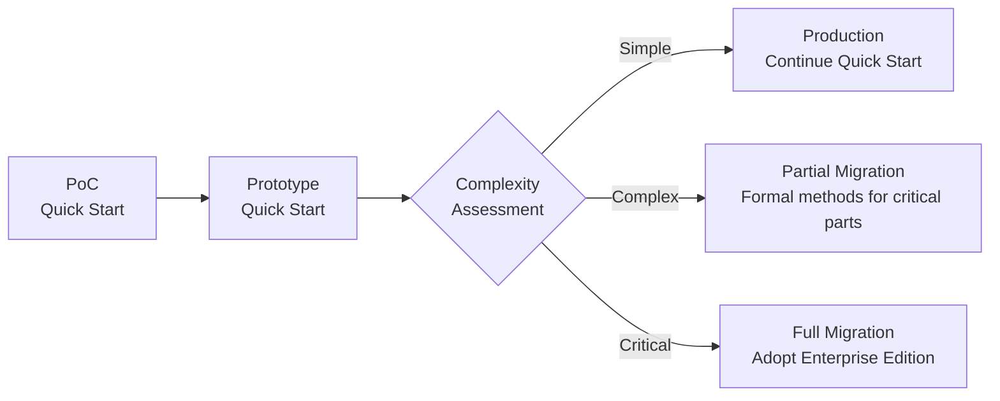
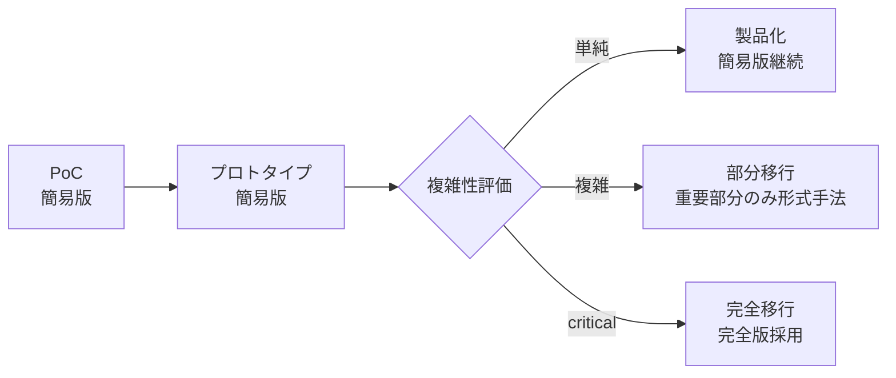

# RigorFlow - AI-Driven Development Framework with Formal Methods

[日本語版はこちら](#rigorflow---ai駆動開発フレームワーク)

## 🎯 Overview

A comprehensive framework for developing software from PoC to mission-critical systems through dialogue with AI assistants (Claude, etc.), progressively applying formal methods based on project complexity.

## 📊 Two Editions

### 🚀 Quick Start Edition
- **Use Cases**: PoC, prototypes, general applications
- **Methods**: BDD+TDD centric
- **Start Time**: 30 seconds
- **Documentation**: 1 document

### 🏗️ Enterprise Edition
- **Use Cases**: Mission-critical systems, finance, healthcare, distributed systems
- **Methods**: BDD+TDD+Formal Methods (TLA+/Dafny)
- **Quality**: Mathematical proof guarantees
- **Documentation**: 6 documents

## 🔄 Progressive Approach



**Important**: All created artifacts (BDD scenarios, tests, code) are **100% reused** during migration.

## 📚 Document Structure

### Diagnostic Support Document
```
📄 Project Assessment Interview Sheet ⭐NEW
   → Streamlines initial diagnosis (5-10 min completion)
   → Structured information gathering
   → Enables accurate AI diagnosis
```

### Common Document
```
📄 AI Chat-Driven Development Guide - Overview & Selection Guide
   → This README and selection guidelines
```

### Quick Start Edition Document
```
📄 AI Chat-Driven Development Unified Guide v2.0
   → Single document, BDD+TDD focused
```

### Enterprise Edition Document Set
```
📁 Formal Methods Framework/
  📄 1. Adaptive Formal Methods Selection Framework
  📄 2. AI Chat-Driven Development Complete Guide
  📄 3. AI Chat-Driven Formal Specification Practice Guide
  📄 4. Formal Specification Correctness Verification Framework
  📄 5. Workspace Execution Environment Guide
  📄 6. Full-Stack Development Integration Guide
```

## 🚀 Quick Start

### Method 1: Using Interview Sheet (Recommended) ⭐

```markdown
1. Complete the Project Assessment Interview Sheet (5-10 min)
2. Open AI chat (Claude, etc.)
3. Paste the completed sheet and input:

"Please diagnose based on this interview sheet 
and start development."

→ AI automatically selects appropriate edition
```

### Method 2: Interactive Dialogue (Quick Start)

```markdown
1. Open AI chat (Claude, etc.)
2. Input:

"I want to develop [your idea] based on 
AI Chat-Driven Development Unified Guide v2.0.
Please start with diagnosis."
```

### Method 3: Mission-Critical System (Enterprise Edition)

```markdown
1. Open AI chat (Claude, etc.)
2. Input all 6 Enterprise documents
3. Execute:

"I want to develop [system overview] as 
a mission-critical system.
Please conduct full diagnosis including formal methods."
```

## 📈 Progressive Migration Example

### Phase 1: PoC (1 week)
```yaml
Using: Quick Start Edition
Deliverables:
  - BDD scenarios: 10
  - Tests: 50
  - Working prototype
```

### Phase 2: Issue Discovery
```yaml
Issue: Data races in concurrent processing
Action: Add partial formal methods
Additional work:
  - TLA+ specs for affected parts: 2 days
  - Property tests addition: 1 day
Existing assets: All continued use
```

### Phase 3: Production
```yaml
Decision: Partial application sufficient
Final configuration:
  - 90%: BDD+TDD (Quick Start)
  - 10%: Formal methods (critical parts only)
Quality: Sufficient reliability assured
```

## 🎯 Selection Guidelines

### Use Quick Start Edition for:

- ✅ Startup initial development
- ✅ Internal tools
- ✅ General web applications
- ✅ PoC/Prototypes
- ✅ Limited time and budget

### Use Enterprise Edition for:

- ✅ Financial/Payment systems
- ✅ Medical device software
- ✅ Autonomous vehicles/Aerospace
- ✅ Cryptography/Security products
- ✅ Regulatory compliance requirements

### When in Doubt

```markdown
Principle: Start with Quick Start Edition
Reason: 
  - Migrate after needs become clear
  - Don't waste existing assets
  - Avoid excessive formalization
```

## 💡 Frequently Asked Questions

**Q: Where should I start?**
```
A: Start with the Project Assessment Interview Sheet.
   5-10 minutes of completion enables AI to diagnose
   the optimal approach.
```

**Q: Will Quick Start work be wasted?**
```
A: No. BDD scenarios, tests, and code are
   100% inherited. Formal methods are "additions."
```

**Q: When should I consider migration?**
```
A: When you see these signs:
   - Hard-to-debug concurrency bugs
   - Uncertainty about computational correctness
   - New regulatory requirements
```

**Q: Is partial migration possible?**
```
A: Yes. We recommend hybrid operation:
   Apply formal methods to critical 10%,
   Keep remaining 90% as Quick Start.
```

**Q: Team lacks formal methods knowledge?**
```
A: AI generates and explains formal specs.
   Deep understanding unnecessary - ability to
   review and utilize AI output is sufficient.
```

## 📊 Edition Comparison

| Item | Quick Start | Enterprise |
|------|-------------|------------|
| **Start Time** | 30 seconds | 30 minutes |
| **Required Docs** | 1 | 6 |
| **BDD+TDD** | ✅ | ✅ |
| **Formal Methods** | Selective (2%) | Systematic |
| **Quality Assurance** | Tests | Tests+Proofs |
| **Learning Cost** | Low | Medium-High |
| **Dev Speed** | Fast | Careful |
| **Bug Reduction** | 60% | 95% |
| **Applicable Projects** | 90% | 10% |

## 🚦 Start Now

### Step 1: Choose Diagnostic Method

#### Option A: Use Interview Sheet (Recommended) ⭐
```markdown
"Please show the Project Assessment Interview Sheet"

→ Complete sheet (5-10 min)
→ Submit to AI
→ Immediate diagnosis & development start
```

#### Option B: Interactive Dialogue
```markdown
"Conduct project diagnosis:
- Content: [idea]
- Importance: [low/medium/high]
- Deadline: [timeframe]

Please determine if Quick Start or Enterprise
Edition is appropriate."
```

### Step 2: Begin
```markdown
Based on diagnosis results:

If Quick Start:
"Start with AI Chat-Driven Development Unified Guide v2.0"

If Enterprise:
"Start with Enterprise 6 documents including formal methods"
```

## 📚 Document Access

All documents are provided as part of this framework.
Request "Show [guide name]" from AI chat to access specific documents.

## 🎓 Support

- **Problem Solving**: Ask AI directly
- **Migration Consultation**: AI diagnoses & suggests
- **Quality Improvement**: AI provides continuous support

---

# RigorFlow - AI駆動開発フレームワーク

## 🎯 概要

AIチャット（Claude等）との対話により、PoCから高信頼性システムまで段階的に開発するフレームワークです。プロジェクトの複雑度に応じて形式手法を段階的に適用します。

## 📊 2つのエディション

### 🚀 簡易版（Quick Start Edition）
- **用途**: PoC、プロトタイプ、一般的なアプリケーション
- **手法**: BDD+TDD中心
- **開始**: 30秒
- **文書**: 1つ

### 🏗️ 完全版（Enterprise Edition）
- **用途**: 高信頼性システム、金融、医療、分散システム
- **手法**: BDD+TDD+形式手法（TLA+/Dafny）
- **品質**: 数学的証明による保証
- **文書**: 6つ

## 🔄 段階的アプローチ



**重要**: 作成済みの成果物（BDDシナリオ、テスト、コード）は移行時も**100%活用**されます。

## 📚 文書構成

### 診断支援文書
```
📄 プロジェクト診断ヒアリングシート ⭐NEW
   → 初回診断を効率化（5-10分で記入）
   → 構造化された情報収集
   → AIの的確な診断を支援
```

### 共通文書
```
📄 AIチャット駆動開発ガイド - 概要と選択指針
   → このREADMEと選択ガイド
```

### 簡易版の文書
```
📄 AIチャット駆動開発統合ガイド v2.0
   → 1文書完結、BDD+TDD中心
```

### 完全版の文書セット
```
📁 形式手法フレームワーク/
  📄 1. 適応的形式手法選択フレームワーク
  📄 2. AIチャット駆動開発完全ガイド
  📄 3. AIチャット駆動形式的仕様開発実践ガイド
  📄 4. 形式的仕様書正しさ検証フレームワーク
  📄 5. ワークスペース実行環境ガイド
  📄 6. フルスタック開発統合ガイド
```

## 🚀 クイックスタート

### 方法1: ヒアリングシート使用（推奨）⭐

```markdown
1. プロジェクト診断ヒアリングシートを記入（5-10分）
2. AIチャット（Claude等）を開く
3. 記入済みシートを貼り付けて以下を入力：

「このヒアリングシートに基づいて診断し、
開発を開始してください。」

→ AIが自動的に適切なエディションを選択
```

### 方法2: 対話形式（簡易版）

```markdown
1. AIチャット（Claude等）を開く
2. 以下を入力：

「AIチャット駆動開発統合ガイド v2.0に基づいて
[あなたのアイデア]を開発したいです。
診断から始めてください。」
```

### 方法3: 高信頼性システム（完全版指定）

```markdown
1. AIチャット（Claude等）を開く
2. 完全版6文書を入力
3. 以下を実行：

「高信頼性システムとして
[システム概要]を開発します。
形式手法を含む完全な診断を実施してください。」
```

## 📈 段階的移行例

### Phase 1: PoC（1週間）
```yaml
使用: 簡易版
成果:
  - BDDシナリオ: 10個
  - テスト: 50個
  - 動作するプロトタイプ
```

### Phase 2: 問題発見
```yaml
問題: 並行処理でデータ競合
対応: 部分的に形式手法追加
追加作業:
  - 該当部分のTLA+仕様: 2日
  - プロパティテスト追加: 1日
既存資産: すべて継続利用
```

### Phase 3: 本番化
```yaml
判定: 部分適用で十分
最終構成:
  - 90%: BDD+TDD（簡易版）
  - 10%: 形式手法（重要部分のみ）
品質: 十分な信頼性を確保
```

## 🎯 選択ガイドライン

### こんな時は簡易版

- ✅ スタートアップの初期開発
- ✅ 社内ツール
- ✅ 一般的なWebアプリ
- ✅ PoC・プロトタイプ
- ✅ 時間とコストが限られている

### こんな時は完全版

- ✅ 金融・決済システム
- ✅ 医療機器ソフトウェア
- ✅ 自動運転・航空宇宙
- ✅ 暗号・セキュリティ製品
- ✅ 規制で証明が必要

### 迷ったら

```markdown
原則: 簡易版から開始
理由: 
  - 必要性が明確になってから移行
  - 既存資産を無駄にしない
  - 過度な形式化を避ける
```

## 💡 よくある質問

**Q: どこから始めればいい？**
```
A: プロジェクト診断ヒアリングシートから始めてください。
   5-10分の記入でAIが最適なアプローチを診断します。
```

**Q: 簡易版で作ったものは無駄になる？**
```
A: いいえ。BDDシナリオ、テスト、コードは
   100%継承されます。形式手法は「追加」です。
```

**Q: いつ移行を検討すべき？**
```
A: 以下の兆候が見えたとき：
   - デバッグが困難な並行性バグ
   - 計算の正確性に確信が持てない
   - 規制要件が追加された
```

**Q: 部分移行は可能？**
```
A: はい。重要な10%だけ形式手法を適用し、
   残り90%は簡易版のままという
   ハイブリッド運用を推奨します。
```

**Q: チームに形式手法の知識がない**
```
A: AIが形式仕様を生成・説明します。
   深い理解は不要で、AIの出力を
   レビュー・活用できれば十分です。
```

## 📊 エディション比較表

| 項目 | 簡易版 | 完全版 |
|------|--------|--------|
| **開始時間** | 30秒 | 30分 |
| **必要文書** | 1 | 6 |
| **BDD+TDD** | ✅ | ✅ |
| **形式手法** | 選択的(2%) | 体系的 |
| **品質保証** | テスト | テスト+証明 |
| **学習コスト** | 低 | 中～高 |
| **開発速度** | 高速 | 慎重 |
| **バグ削減** | 60% | 95% |
| **適用プロジェクト** | 90% | 10% |

## 🚦 今すぐ始める

### Step 1: 診断方法を選択

#### Option A: ヒアリングシート使用（推奨）⭐
```markdown
「プロジェクト診断ヒアリングシートを表示してください」

→ シートに記入（5-10分）
→ AIに提出
→ 即座に診断・開発開始
```

#### Option B: 対話形式
```markdown
「プロジェクト診断を実施：
- 内容：[アイデア]
- 重要度：[低/中/高]
- 期限：[期間]

簡易版と完全版どちらが適切か
判定してください。」
```

### Step 2: 開始
```markdown
診断結果に基づいて：

簡易版なら：
「AIチャット駆動開発統合ガイド v2.0で開始」

完全版なら：
「完全版6文書で形式手法を含めて開始」
```

## 📚 文書の入手

すべての文書は、このフレームワークの一部として提供されています。
AIチャットに「○○ガイドを表示」と依頼すれば、該当文書が提示されます。

## 🎓 サポート

- **問題解決**: AIに直接質問
- **移行相談**: AIが診断・提案
- **品質改善**: AIが継続的に支援

---

**Framework Version**: 3.1  
**Last Updated**: 2025-01-08  
**License**: MIT

## まとめ

このフレームワークにより：

1. **ヒアリングシートで効率的に開始**（5-10分で診断）⭐
2. **簡易版で素早く開始**（PoC 1週間）
3. **必要に応じて段階的強化**（部分移行）
4. **既存資産を100%活用**（無駄なし）
5. **最適な品質レベル達成**（過不足なし）

**今すぐ始められます。「プロジェクト診断ヒアリングシートを表示」とAIに依頼してください。**