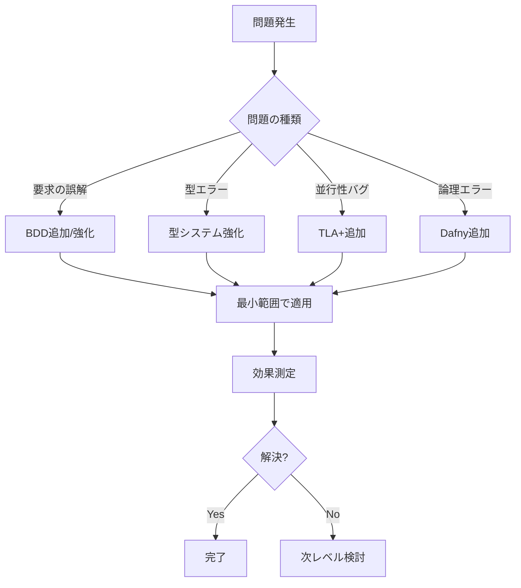

# 適応的形式手法選択フレームワーク

## 概要

本フレームワークは、プロジェクトの特性に応じて最適な形式手法を動的に選択・追加するためのガイドです。AIとの対話を通じて、最小限の手法から始め、必要に応じて段階的に形式手法を追加します。

## 1. 形式手法の階層モデル

### Level 0: 基本構成（全プロジェクト必須）
```yaml
手法:
  - 自然言語要求定義
  - 基本的なユニットテスト
  
適用基準: すべてのプロジェクト
コスト: 最小
効果: 基本的な品質保証
```

### Level 1: 軽量形式手法
```yaml
手法:
  - BDD（Behavior Driven Development）
  - 契約による設計（Design by Contract）
  - Property Based Testing
  
適用基準:
  - 要求が複雑
  - 振る舞いの明確化が重要
  - エッジケースが多い
  
コスト: 学習2-3日、継続的適用
効果: 要求齟齬50%削減、エッジケースカバー率向上
```

### Level 2: 型による仕様
```yaml
手法:
  - 強い型システム（TypeScript、Rust等）
  - 代数的データ型
  - ファントム型
  - 型レベルプログラミング
  
適用基準:
  - データ構造が複雑
  - 不変条件が重要
  - コンパイル時保証が必要
  
コスト: 言語依存、学習1週間
効果: 型関連バグ80%削減
```

### Level 3: モデル検査
```yaml
手法:
  - TLA+（時相論理、並行システム）
  - Alloy（関係論理、構造モデル）
  - Promela/SPIN（プロトコル検証）
  
適用基準:
  - 並行処理が複雑
  - 分散システム
  - デッドロック・競合状態のリスク
  - タイミング依存の処理
  
コスト: 学習2週間、適用1週間/機能
効果: 並行性バグ90%削減
```

### Level 4: 定理証明
```yaml
手法:
  - Dafny（契約＋自動証明）
  - Coq（対話的証明）
  - Isabelle（高階論理）
  - F*（関数型＋証明）
  
適用基準:
  - 数学的証明が必要
  - 安全性が極めて重要
  - 規制要件での証明必要
  - 暗号実装
  
コスト: 学習3週間、適用2週間/機能
効果: 論理バグ95%削減、証明による保証
```

## 2. プロジェクト診断プロトコル

### 初期診断（プロジェクト開始時）

```markdown
## AIへの診断依頼テンプレート

「以下のプロジェクト情報から、適切な形式手法を提案してください：

### プロジェクト基本情報
- システム名：[名称]
- 概要：[1-3文で説明]
- 規模：[小規模/中規模/大規模]
- 期間：[開発期間]
- チーム：[人数とスキル]

### システム特性
- 並行性：[なし/低/中/高]
- 分散性：[単一/複数ノード/地理分散]
- リアルタイム性：[不要/ソフト/ハード]
- データ整合性：[結果整合性/強整合性]

### 品質要求
- 信頼性：[通常/高/ミッションクリティカル]
- セキュリティ：[通常/重要/最重要]
- 性能：[通常/高速/超高速]
- 保守性：[短期/長期]

### リスク要因
- 失敗時の影響：[軽微/中程度/重大/破滅的]
- 複雑度：[単純/通常/複雑/非常に複雑]
- 新規性：[実績あり/一部新規/全く新規]

### 制約条件
- 技術選択：[自由/一部制約/厳格]
- 予算：[潤沢/通常/限定的]
- 納期：[余裕/通常/タイト]

以下を提案してください：
1. 開始時の最小構成（Level 0-1）
2. 推奨される追加手法（Level 2-4）
3. 段階的追加計画
4. リスクと対策」
```

### 診断結果の解釈

```yaml
risk_complexity_matrix:
  低リスク_低複雑度:
    例: "社内ツール、プロトタイプ"
    推奨:
      開始時: Level 0 + BDD
      追加検討: 不要
      
  低リスク_高複雑度:
    例: "ゲーム、可視化ツール"
    推奨:
      開始時: Level 0-1
      追加検討: Level 2（型システム）
      条件付き: Level 3（並行処理部分のみ）
      
  高リスク_低複雑度:
    例: "決済API、認証システム"
    推奨:
      開始時: Level 0-1 + Level 2
      追加検討: Level 4（コア機能のみ）
      
  高リスク_高複雑度:
    例: "金融取引、医療システム、自動運転"
    推奨:
      開始時: Level 0-2 フルセット
      追加必須: Level 3-4（段階的に）
      継続的: 形式手法の見直し
```

## 3. 動的追加プロトコル

### 問題検出による手法追加

```markdown
## 問題発生時のAI相談テンプレート

「開発中に以下の問題が発生しました：

### 問題の詳細
- 症状：[具体的な現象]
- 発生条件：[再現手順]
- 影響範囲：[どこまで影響するか]
- 頻度：[常に/時々/稀に]

### 現在の対策
- 実施済み：[試した解決策]
- 効果：[効果の有無]

### 質問
1. この問題の根本原因は何か？
2. 追加の形式手法で解決可能か？
3. 必要最小限の追加手法は？
4. 実装への影響は？」
```

### 手法追加の判断基準



## 4. 言語非依存の実装戦略

### 形式手法と実装言語のマッピング

```yaml
Level_1_BDD:
  任意の言語:
    - Cucumber系ツール
    - 言語固有のBDDフレームワーク
    - 最悪、コメントとテストで代替

Level_2_型システム:
  静的型付け言語:
    - TypeScript、Rust、Haskell、F#、Scala
  動的型付け言語:
    - Python（型ヒント）、Ruby（Sorbet）
    - 実行時契約チェックで補完

Level_3_TLA+:
  実装マッピング:
    並行処理モデル:
      - Go: goroutine + channels
      - Erlang/Elixir: Actor model
      - Java: CompletableFuture、Akka
      - Python: asyncio、multiprocessing
      - JavaScript: async/await、Worker
      - Rust: async/.await、channels
    
Level_4_Dafny:
  実装マッピング:
    契約の実装:
      - Rust: debug_assert!、型システム
      - Java: assert、アノテーション
      - Python: assert、デコレータ
      - C++: concepts、static_assert
      - JavaScript: 実行時チェック
```

### 言語選択のAI支援

```markdown
## 言語選択の相談テンプレート

「形式手法と実装言語の最適な組み合わせを提案してください：

### 形式仕様
- Level 3: TLA+で並行処理モデル化済み
- Level 4: Dafnyで暗号部分仕様化済み

### 制約条件
- チームスキル：[使える言語リスト]
- 既存システム：[連携必要なシステム]
- 実行環境：[ブラウザ/サーバー/組み込み]
- 性能要求：[レスポンス時間等]

### 質問
1. TLA+仕様の実装に適した言語は？
2. Dafny仕様の実装に適した言語は？
3. 言語間の連携方法は？
4. それぞれの言語での実装パターンは？」
```

## 5. 実践例

### 例1：チャットアプリケーション

```yaml
初期診断:
  並行性: 中（複数ユーザー）
  リスク: 低（エンタメ用途）
  複雑度: 低～中

Phase_1_開始時:
  - Level 0: 基本テスト
  - Level 1: BDD（主要フロー）
  言語: 任意（Node.js、Python等）

Phase_2_問題発生時:
  問題: "メッセージ順序が乱れる"
  追加: Level 3: TLA+（メッセージ順序モデル）
  実装: チャネル順序保証の追加

Phase_3_スケール時:
  問題: "1000人同時接続で破綻"
  追加: 負荷テスト＋アーキテクチャ見直し
  ※形式手法追加は不要と判断
```

### 例2：暗号資産ウォレット

```yaml
初期診断:
  セキュリティ: 最重要
  リスク: 最高（資産損失）
  複雑度: 高（暗号処理）

Phase_1_開始時:
  - Level 0-1: 基本＋BDD
  - Level 2: 強い型（Rust/TypeScript）
  - Level 4: Dafny（暗号コア）
  言語: Rust（安全性重視）

Phase_2_実装時:
  すべての暗号操作をDafny仕様化
  Rustで証明可能な実装
  Property Based Testingで補完

Phase_3_監査前:
  Level 3: TLA+で全体フロー検証
  形式的証明の完全性確認
```

### 例3：ECサイト

```yaml
初期診断:
  並行性: 中（在庫管理）
  リスク: 中（金銭扱い）
  複雑度: 中

Phase_1_開始時:
  - Level 0-1: 基本＋BDD
  - Level 2: 型システム（TypeScript）
  言語: TypeScript + Node.js

Phase_2_在庫問題:
  問題: "同時購入で在庫不整合"
  追加: トランザクション設計
  ※TLA+は過剰と判断、DBレベルで解決

Phase_3_決済追加:
  追加: Level 2強化（決済の型安全性）
  外部APIは契約による設計
```

## 6. 効果測定とフィードバック

### メトリクス収集

```yaml
測定項目:
  形式手法の効果:
    - バグ検出率の変化
    - 開発速度への影響
    - 保守性の向上度
    
  コスト:
    - 学習時間
    - 適用時間
    - 保守コスト
    
  ROI:
    - (削減されたバグ修正コスト) / (形式手法導入コスト)
```

### 継続的改善

```markdown
## 定期レビューテンプレート

「現在の形式手法の使用状況をレビューしてください：

### 使用中の手法
- Level 0-1: [使用状況]
- Level 2: [使用状況]
- Level 3: [使用状況]
- Level 4: [使用状況]

### 効果測定
- 発見されたバグ：[種類と数]
- 防げたバグ：[推定]
- 開発速度：[影響]

### 質問
1. 過剰な形式手法はあるか？
2. 不足している手法はあるか？
3. より軽量な代替手法はあるか？
4. 次フェーズでの調整は？」
```

## 7. アンチパターンと対策

### よくある失敗

```yaml
過剰な形式化:
  症状: "すべてをTLA+で書こうとする"
  問題: 開発速度低下、保守困難
  対策: リスクベースで選択、段階的導入

形式手法の放置:
  症状: "仕様を書いたが更新しない"
  問題: 仕様と実装の乖離
  対策: 最小限の仕様、生きた文書化

不適切な手法選択:
  症状: "UIロジックをDafnyで証明"
  問題: 投資対効果が悪い
  対策: 適材適所、AIに相談

チーム能力無視:
  症状: "難しい手法を強制"
  問題: 理解不足、間違った適用
  対策: 段階的学習、必要最小限
```

## まとめ

このフレームワークにより：

1. **適応的選択**: プロジェクトに最適な手法を選択
2. **段階的導入**: 最小から始めて必要に応じて追加
3. **言語非依存**: 任意の言語で実装可能
4. **費用対効果**: 過剰な形式化を避け、実用性重視
5. **継続的改善**: フィードバックによる最適化

AIとの対話を通じて、各プロジェクトに最適な形式手法の組み合わせを実現します。