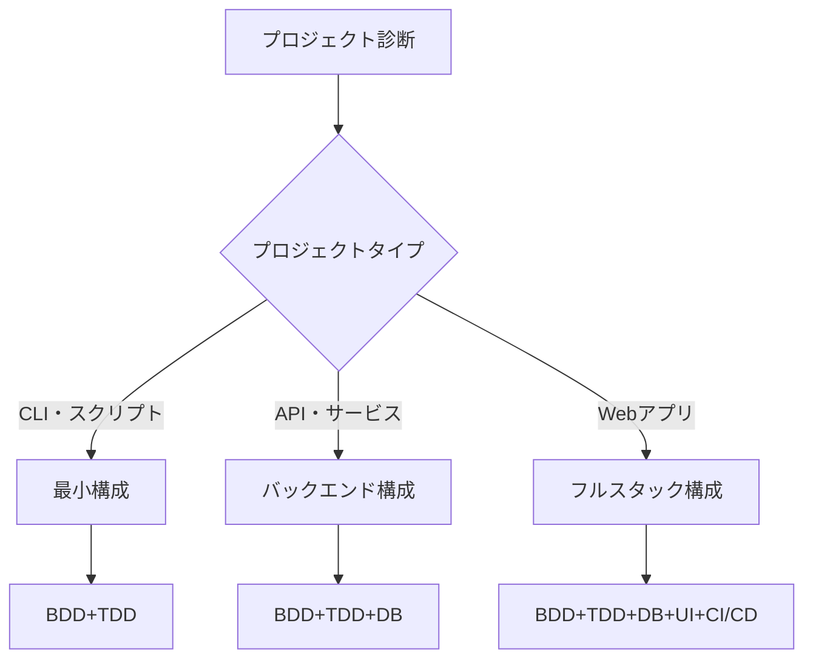

# AIチャット駆動開発統合ガイド v2.1

## 📌 このガイドについて

AIチャット（Claude等）との対話だけで、要求定義から本番デプロイまでを完結させる統合ガイドです。BDD+TDDを中心に、必要に応じて形式手法を選択的に使用します。

**v2.1の新機能**: プロジェクト診断ヒアリングシートによる効率的な開始 ⭐

## 🚀 クイックスタート

### 方法1: ヒアリングシート使用（推奨）⭐

```markdown
1. AIチャットで以下を入力：
   「プロジェクト診断ヒアリングシートを表示」
2. シートに記入（5-10分）
3. 記入済みシートをAIに提出：
   「このヒアリングシートに基づいて診断し、開発を開始してください」
```

### 方法2: 30秒で開始（対話形式）

```markdown
1. AIチャット（Claude/Claude Code）を開く
2. このガイドを入力
3. 以下を実行：

「プロジェクトを開始します。
[あなたのアイデア]を作りたいです。
診断から始めてください。」
```

## 📊 プロジェクト診断フロー

### Phase 0: 自動診断（5-30分）

#### 方法1: ヒアリングシート使用（推奨）⭐
```markdown
「プロジェクト診断ヒアリングシートを表示してください」

→ シートに記入（5-10分）
→ AIに提出
→ 即座に診断結果
```

#### 方法2: 対話形式
```markdown
「以下のプロジェクトを診断してください：

概要: [1-2文で説明]
重要度: [趣味/業務/ミッションクリティカル]
規模: [個人/チーム/大規模]」
```

#### AIの診断項目

```yaml
診断結果:
  リスクレベル: [低/中/高]
  技術構成:
    - タイプ: [CLI/API/Webアプリ/モバイル]
    - DB必要性: [不要/軽量/本格的]
    - UI必要性: [不要/シンプル/リッチ]
  
  推奨手法:
    必須: 
      - BDD（振る舞い仕様）
      - TDD（テスト駆動開発）
    オプション:
      - 型システム（複雑なデータ）
      - モデル検査（並行処理あり）
      - 形式証明（暗号・金融のみ）
  
  技術スタック:
    言語: [AIが提案 or チーム指定]
    フレームワーク: [必要に応じて]
    インフラ: [ローカル/クラウド]
```

### 診断による分岐



## 🔄 開発サイクル

### 基本サイクル（全プロジェクト共通）


### Phase 1: BDD要求定義

#### 基本テンプレート
```gherkin
Feature: [機能名]
  As a [ユーザー種別]
  I want [何をしたい]
  So that [なぜ必要]

  Scenario: [シナリオ名]
    Given [前提条件]
    When [アクション]
    Then [期待結果]
```

#### 層別BDDシナリオ

**ビジネスロジック層**
```gherkin
Scenario: ゲーム勝敗判定
  Given プレイヤー1が「グー」
  And プレイヤー2が「チョキ」
  When 勝敗を判定
  Then プレイヤー1の勝利
```

**データベース層**（必要な場合）
```gherkin
Scenario: 結果の永続化
  Given ゲーム結果が確定
  When データベースに保存
  Then 履歴から参照可能
```

**UI層**（必要な場合）
```gherkin
Scenario: 結果表示
  Given ゲームが終了
  When 結果画面を表示
  Then 勝敗がアニメーション表示
```

### Phase 2-4: TDDサイクル

#### 環境別の実行方法

**チャット環境（コード生成のみ）**
```markdown
1. AI: 「テストコードを生成します」
2. 人間: コピーして手動実行
3. AI: 「実装を生成します」
4. 人間: 実行して確認
```

**ワークスペース環境（自動実行）**
```markdown
1. AI: テスト作成 → 自動実行 → 失敗確認
2. AI: 実装作成 → 自動実行 → 成功確認
3. AI: リファクタリング → 自動再テスト
```

#### TDDの実例

```python
# Cycle 1: RED
def test_judge_game():
    assert judge_game("rock", "scissors") == "player1"  # 失敗

# Cycle 2: GREEN
def judge_game(p1, p2):
    return "player1"  # 最小実装

# Cycle 3: REFACTOR
def judge_game(p1, p2):
    rules = {
        ("rock", "scissors"): "player1",
        ("scissors", "paper"): "player1",
        ("paper", "rock"): "player1",
    }
    return rules.get((p1, p2), "player2")
```

## 🏗️ プロジェクト構成パターン

### パターン1: 最小構成（CLI・スクリプト）

```
project/
├── src/
│   └── main.py
├── tests/
│   └── test_main.py
└── README.md
```

**必要な手法**: BDD+TDD のみ

### パターン2: API構成（バックエンド）

```
project/
├── src/
│   ├── api/
│   ├── models/
│   └── services/
├── tests/
│   ├── unit/
│   └── integration/
├── database/
│   └── migrations/
└── docker-compose.yml
```

**必要な手法**: BDD+TDD+DB設計

### パターン3: フルスタック構成

```
project/
├── backend/
│   ├── src/
│   └── tests/
├── frontend/
│   ├── src/
│   └── tests/
├── database/
│   └── migrations/
├── .github/
│   └── workflows/
└── docker-compose.yml
```

**必要な手法**: BDD+TDD+DB+UI+CI/CD

## 🎯 品質保証戦略

### カバレッジ目標

| 層 | 最小 | 推奨 | 測定方法 |
|----|------|------|----------|
| ユニットテスト | 70% | 90% | `pytest --cov` |
| 統合テスト | 50% | 80% | API/DBテスト |
| E2Eテスト | 主要フロー | 全シナリオ | Playwright等 |

### 継続的品質チェック

```yaml
自動チェック項目:
  - テスト実行: すべてのpush時
  - カバレッジ: PR時に確認
  - 型チェック: 静的解析
  - セキュリティ: 依存関係スキャン
```

## 🔧 技術選択ガイド

### 言語選択マトリックス

| 要件 | 推奨言語 | 理由 |
|------|----------|------|
| **高速開発** | Python, JavaScript | 豊富なライブラリ |
| **型安全性** | TypeScript, Rust | コンパイル時チェック |
| **高性能** | Rust, Go | システムレベル性能 |
| **並行処理** | Go, Elixir | 組み込みサポート |
| **Web UI** | TypeScript + React/Vue | エコシステム |

### データベース選択

```yaml
用途別推奨:
  シンプル: SQLite（ファイルDB）
  一般的: PostgreSQL（RDBMS）
  大規模: PostgreSQL + Redis
  NoSQL: MongoDB（ドキュメント型）
  リアルタイム: Firebase/Supabase
```

## 📝 AIとの効果的な対話

### 良い指示の例

```markdown
✅ 具体的で段階的
「ユーザー認証機能を追加したい。
まずBDDシナリオを作成し、
その後JWTを使ったTDD実装を進めてください。」

✅ 制約を明確に
「Pythonで、FastAPIを使い、
PostgreSQLに接続する設定で進めてください。」

✅ 品質基準を指定
「カバレッジ90%以上、
型ヒント必須で実装してください。」
```

### 避けるべき指示

```markdown
❌ 曖昧
「いい感じのアプリ作って」

❌ 一度に多すぎ
「全機能を一度に実装して」

❌ 前提なし
「デプロイして」（環境未指定）
```

## 🚦 フェーズ別チェックリスト

### ✅ Phase 0: 診断
- [ ] プロジェクトタイプ決定
- [ ] 技術スタック選択
- [ ] 必要な手法の特定

### ✅ Phase 1: 要求
- [ ] BDDシナリオ作成
- [ ] 受け入れ条件明確化
- [ ] 優先順位決定

### ✅ Phase 2-4: 実装
- [ ] テストファースト徹底
- [ ] カバレッジ目標達成
- [ ] リファクタリング完了

### ✅ Phase 5: 統合
- [ ] 統合テスト実施
- [ ] E2Eテスト成功
- [ ] パフォーマンス確認

### ✅ Phase 6: デプロイ
- [ ] CI/CDパイプライン
- [ ] 環境変数設定
- [ ] モニタリング設定

## 🎓 形式手法の選択的使用

### いつ使うか

```yaml
形式手法の適用基準:
  
  不要（90%のプロジェクト）:
    - 一般的なWebアプリ
    - CRUD操作中心
    - UIフォーカス
    
  検討（8%）:
    - 複雑な並行処理 → モデル検査
    - 複雑なデータ構造 → 型システム
    
  必要（2%）:
    - 暗号実装 → 形式証明
    - 金融計算 → 数学的証明
    - 人命関連 → 完全検証
```

### 段階的追加

```markdown
問題: 「並行処理でデッドロック」
→ AI: 「この部分だけTLA+でモデル化しましょう」

問題: 「暗号処理の正確性が不安」
→ AI: 「Dafnyで証明を追加しましょう」
```

## 💡 トラブルシューティング

### よくある問題と解決

| 問題 | 原因 | 解決方法 |
|------|------|----------|
| テスト失敗 | 要求の誤解 | BDDシナリオ見直し |
| 遅い開発 | 過度な形式化 | 必要最小限に削減 |
| 統合エラー | 型不一致 | インターフェース明確化 |
| デプロイ失敗 | 環境差異 | Docker化 |

## 📈 成功指標

```yaml
品質指標:
  バグ密度: < 1/KLOC
  カバレッジ: > 80%
  技術的負債: 最小

効率指標:
  開発速度: 従来比 2x
  手戻り: < 10%
  自動化率: > 70%

ビジネス指標:
  要求充足: 100%
  納期遵守: 95%
  保守性: 高
```

## 🔄 継続的改善

### 振り返りテンプレート

```markdown
「プロジェクトの振り返りを実施してください：

良かった点:
- [AIが分析]

改善点:
- [AIが提案]

次回への適用:
- [AIが計画]」
```

## 📚 付録: 最小限の前提知識

### 必須
- プログラミング基礎
- Git基本操作

### 推奨
- テストの概念
- Webの基礎（Webアプリの場合）

### 不要
- 形式手法の詳細
- 特定フレームワークの深い知識
- DevOpsツールの詳細

---

**バージョン**: 2.1  
**最終更新**: 2025年8月8日  
**ライセンス**: MIT

## まとめ

このガイド1つで、AIとの対話による開発のすべてをカバーします。

**特徴**:
1. **効率的**: ヒアリングシートで5-10分診断
2. **実践的**: BDD+TDD中心で実用的
3. **適応的**: プロジェクトに応じて手法選択
4. **完全**: CLI〜フルスタックまで対応
5. **シンプル**: 必要最小限の文書

**使い方**:
1. ヒアリングシートで診断（推奨）
2. またはこのガイドをAIに入力
3. プロジェクトを説明
4. AIの指示に従って開発

以上です。