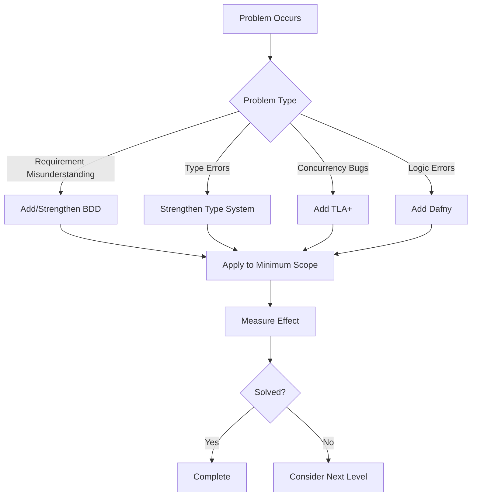

# Adaptive Formal Methods Selection Framework

## Overview

This framework provides a guide for dynamically selecting and adding optimal formal methods based on project characteristics. Through AI dialogue, you start with minimal methods and gradually add formal methods as needed.

## 1. Formal Methods Hierarchy Model

### Level 0: Basic Configuration (Required for All Projects)
```yaml
methods:
  - Natural language requirements definition
  - Basic unit testing
  
application_criteria: All projects
cost: Minimal
effect: Basic quality assurance
```

### Level 1: Lightweight Formal Methods
```yaml
methods:
  - BDD (Behavior Driven Development)
  - Design by Contract
  - Property Based Testing
  
application_criteria:
  - Complex requirements
  - Important behavior clarification
  - Many edge cases
  
cost: 2-3 days learning, continuous application
effect: 50% reduction in requirement misunderstandings, improved edge case coverage
```

### Level 2: Type-based Specification
```yaml
methods:
  - Strong type systems (TypeScript, Rust, etc.)
  - Algebraic data types
  - Phantom types
  - Type-level programming
  
application_criteria:
  - Complex data structures
  - Important invariants
  - Compile-time guarantees needed
  
cost: Language-dependent, 1 week learning
effect: 80% reduction in type-related bugs
```

### Level 3: Model Checking
```yaml
methods:
  - TLA+ (temporal logic, concurrent systems)
  - Alloy (relational logic, structural models)
  - Promela/SPIN (protocol verification)
  
application_criteria:
  - Complex concurrency
  - Distributed systems
  - Deadlock/race condition risks
  - Timing-dependent processing
  
cost: 2 weeks learning, 1 week/feature application
effect: 90% reduction in concurrency bugs
```

### Level 4: Theorem Proving
```yaml
methods:
  - Dafny (contracts + automatic proving)
  - Coq (interactive proving)
  - Isabelle (higher-order logic)
  - F* (functional + proving)
  
application_criteria:
  - Mathematical proofs required
  - Extremely important safety
  - Regulatory proof requirements
  - Cryptographic implementation
  
cost: 3 weeks learning, 2 weeks/feature application
effect: 95% reduction in logic bugs, proof-based guarantees
```

## 2. Project Diagnosis Protocol

### Initial Diagnosis (At Project Start)

```markdown
## AI Diagnosis Request Template

"Please suggest appropriate formal methods based on the following project information:

### Basic Project Information
- System name: [name]
- Overview: [1-3 sentence explanation]
- Scale: [small/medium/large]
- Duration: [development period]
- Team: [size and skills]

### System Characteristics
- Concurrency: [none/low/medium/high]
- Distribution: [single/multiple nodes/geographically distributed]
- Real-time: [not required/soft/hard]
- Data consistency: [eventual consistency/strong consistency]

### Quality Requirements
- Reliability: [normal/high/mission-critical]
- Security: [normal/important/critical]
- Performance: [normal/high-speed/ultra-high-speed]
- Maintainability: [short-term/long-term]

### Risk Factors
- Impact of failure: [minor/moderate/severe/catastrophic]
- Complexity: [simple/normal/complex/very complex]
- Novelty: [proven track record/partially new/completely new]

### Constraints
- Technology choices: [free/partially constrained/strict]
- Budget: [abundant/normal/limited]
- Deadline: [flexible/normal/tight]

Please suggest:
1. Initial minimal configuration (Level 0-1)
2. Recommended additional methods (Level 2-4)
3. Staged addition plan
4. Risks and countermeasures"
```

### Diagnosis Result Interpretation

```yaml
risk_complexity_matrix:
  low_risk_low_complexity:
    example: "Internal tools, prototypes"
    recommendation:
      initial: Level 0 + BDD
      additional: Not needed
      
  low_risk_high_complexity:
    example: "Games, visualization tools"
    recommendation:
      initial: Level 0-1
      additional: Level 2 (type system)
      conditional: Level 3 (concurrency parts only)
      
  high_risk_low_complexity:
    example: "Payment API, authentication system"
    recommendation:
      initial: Level 0-1 + Level 2
      additional: Level 4 (core functions only)
      
  high_risk_high_complexity:
    example: "Financial trading, medical systems, autonomous driving"
    recommendation:
      initial: Level 0-2 full set
      additional_mandatory: Level 3-4 (gradually)
      continuous: Review formal methods
```

## 3. Dynamic Addition Protocol

### Method Addition Based on Problem Detection

```markdown
## AI Consultation Template for Problems

"The following problem occurred during development:

### Problem Details
- Symptoms: [specific phenomena]
- Occurrence conditions: [reproduction steps]
- Impact scope: [extent of impact]
- Frequency: [always/sometimes/rarely]

### Current countermeasures
- Implemented: [tried solutions]
- Effect: [presence/absence of effect]

### Questions
1. What is the root cause of this problem?
2. Can additional formal methods solve it?
3. What is the minimum additional formal method needed?
4. What is the impact on implementation?"
```

### Criteria for Method Addition



## 4. Language-Independent Implementation Strategy

### Mapping of Formal Methods to Implementation Languages

```yaml
Level_1_BDD:
  any_language:
    - Cucumber-family tools
    - Language-specific BDD frameworks
    - At worst, substitute with comments and tests

Level_2_type_system:
  statically_typed_languages:
    - TypeScript, Rust, Haskell, F#, Scala
  dynamically_typed_languages:
    - Python (type hints), Ruby (Sorbet)
    - Supplement with runtime contract checks

Level_3_TLA+:
  implementation_mapping:
    concurrency_models:
      - Go: goroutine + channels
      - Erlang/Elixir: Actor model
      - Java: CompletableFuture, Akka
      - Python: asyncio, multiprocessing
      - JavaScript: async/await, Worker
      - Rust: async/.await, channels
    
Level_4_Dafny:
  implementation_mapping:
    contract_implementation:
      - Rust: debug_assert!, type system
      - Java: assert, annotations
      - Python: assert, decorators
      - C++: concepts, static_assert
      - JavaScript: runtime checks
```

### AI Support for Language Selection

```markdown
## Language Selection Consultation Template

"Please suggest the optimal combination of formal methods and implementation languages:

### Formal Specifications
- Level 3: Concurrency modeled in TLA+
- Level 4: Cryptographic parts specified in Dafny

### Constraints
- Team skills: [list of usable languages]
- Existing systems: [systems requiring integration]
- Execution environment: [browser/server/embedded]
- Performance requirements: [response time, etc.]

### Questions
1. Which language is suitable for implementing TLA+ specifications?
2. Which language is suitable for implementing Dafny specifications?
3. How to coordinate between languages?
4. What are the implementation patterns in each language?"
```

## 5. Practical Examples

### Example 1: Chat Application

```yaml
initial_diagnosis:
  concurrency: medium (multiple users)
  risk: low (entertainment use)
  complexity: low to medium

Phase_1_initial:
  - Level 0: Basic testing
  - Level 1: BDD (main flows)
  language: Any (Node.js, Python, etc.)

Phase_2_problem_occurrence:
  problem: "Message order gets scrambled"
  addition: Level 3: TLA+ (message ordering model)
  implementation: Add channel ordering guarantees

Phase_3_scaling:
  problem: "System breaks with 1000 simultaneous connections"
  addition: Load testing + architecture review
  note: No additional formal methods needed
```

### Example 2: Cryptocurrency Wallet

```yaml
initial_diagnosis:
  security: critical
  risk: highest (asset loss)
  complexity: high (cryptographic processing)

Phase_1_initial:
  - Level 0-1: Basic + BDD
  - Level 2: Strong types (Rust/TypeScript)
  - Level 4: Dafny (crypto core)
  language: Rust (safety-focused)

Phase_2_implementation:
  all_crypto_operations: Specify in Dafny
  rust_implementation: Provably correct implementation
  supplement: Property Based Testing

Phase_3_pre_audit:
  Level 3: TLA+ for overall flow verification
  formal_proof: Verify completeness
```

### Example 3: E-commerce Site

```yaml
initial_diagnosis:
  concurrency: medium (inventory management)
  risk: medium (handles money)
  complexity: medium

Phase_1_initial:
  - Level 0-1: Basic + BDD
  - Level 2: Type system (TypeScript)
  language: TypeScript + Node.js

Phase_2_inventory_problem:
  problem: "Inventory inconsistency with simultaneous purchases"
  addition: Transaction design
  note: TLA+ deemed excessive, solved at DB level

Phase_3_payment_addition:
  addition: Strengthen Level 2 (payment type safety)
  external_api: Design by Contract
```

## 6. Effect Measurement and Feedback

### Metrics Collection

```yaml
measurement_items:
  formal_method_effects:
    - Change in bug detection rate
    - Impact on development speed
    - Degree of maintainability improvement
    
  cost:
    - Learning time
    - Application time
    - Maintenance cost
    
  roi:
    - (Saved bug fixing cost) / (Formal method introduction cost)
```

### Continuous Improvement

```markdown
## Regular Review Template

"Please review the current usage of formal methods:

### Methods in Use
- Level 0-1: [usage status]
- Level 2: [usage status]
- Level 3: [usage status]
- Level 4: [usage status]

### Effect Measurement
- Bugs found: [type and count]
- Bugs prevented: [estimate]
- Development speed: [impact]

### Questions
1. Are there excessive formal methods?
2. Are there insufficient methods?
3. Are there lighter alternative methods?
4. What adjustments for the next phase?"
```

## 7. Anti-patterns and Countermeasures

### Common Failures

```yaml
excessive_formalization:
  symptom: "Trying to write everything in TLA+"
  problem: Reduced development speed, difficult maintenance
  countermeasure: Risk-based selection, staged introduction

abandoned_formal_methods:
  symptom: "Wrote specifications but don't update them"
  problem: Divergence between specifications and implementation
  countermeasure: Minimal specifications, living documentation

inappropriate_method_selection:
  symptom: "Proving UI logic with Dafny"
  problem: Poor return on investment
  countermeasure: Right tool for the job, consult AI

ignoring_team_capability:
  symptom: "Forcing difficult methods"
  problem: Lack of understanding, incorrect application
  countermeasure: Staged learning, necessary minimum
```

## Summary

This framework enables:

1. **Adaptive Selection**: Choose optimal methods for the project
2. **Staged Introduction**: Start minimal and add as needed
3. **Language Independence**: Implementable in any language
4. **Cost Effectiveness**: Avoid excessive formalization, focus on practicality
5. **Continuous Improvement**: Optimization through feedback

Through AI dialogue, achieve the optimal combination of formal methods for each project.