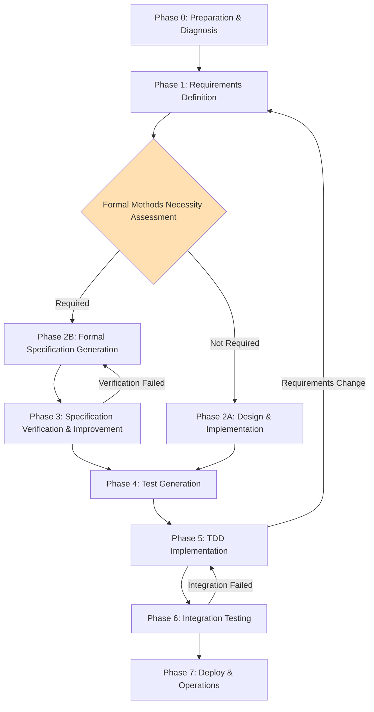
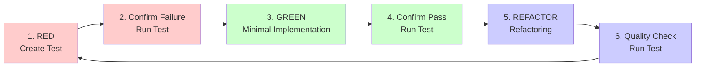
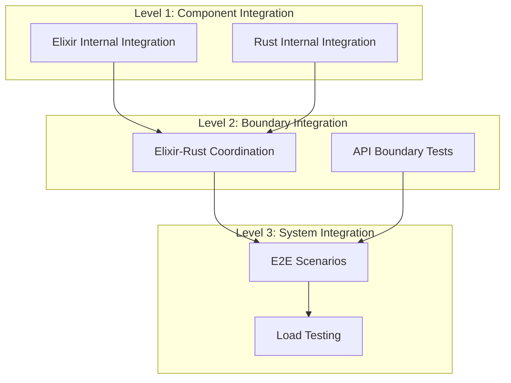
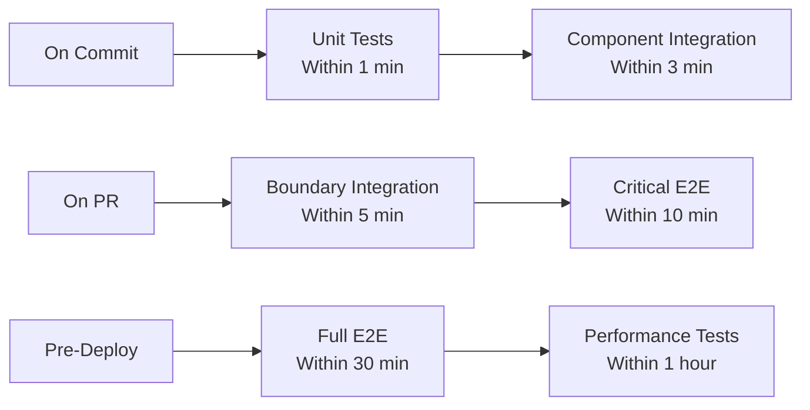

# AI Chat-Driven Development Complete Guide

## 1. AI Chat-Driven Development Process Overall Flow

### 1.1 Process Overview



### 1.2 Phase Details

#### Phase 0: Preparation & Diagnosis (30 minutes - 2 hours)

**Purpose**: Create project foundation and select appropriate methods

**AI Dialogue Example**:
```
User: "I want to create a rock-paper-scissors game using zero-knowledge proofs"

AI: I will diagnose the project. Please provide:
1. System importance (PoC/Business/Mission-critical)
2. Degree of concurrency/distribution
3. Security requirements (presence of cryptographic processing)
4. Team skill set
5. Technical constraints

Diagnosis Result:
- Recommended starting methods: Level 0-1 (Basic + BDD)
- Cryptographic parts: Level 4 (Dafny) recommended
- Implementation language: Suggested based on constraints
```

**Deliverables**:
- Project diagnosis results
- Formal methods selection plan
- Initial requirements list

#### Phase 1: Requirements Definition (1-3 hours)

**Purpose**: Clarify business requirements (described according to formal method levels)

**AI Dialogue Example**:
```
User: "I want to define the basic flow of rock-paper-scissors"

AI: Based on diagnosis results, I will create:
- Level 0: Natural language requirement description
- Level 1 when selected: Add BDD scenarios

Scenario: Normal rock-paper-scissors match
  Given two players are matched
  When both players select and submit moves
  Then winner is determined and result is displayed
```

**Deliverables**:
- Requirements specification (in format according to selected level)
- Acceptance criteria list

#### Phase 2A: Design & Implementation (When formal methods not required)

**Purpose**: Regular design and implementation

**AI Dialogue Example**:
```
User: "I want to proceed with architecture design"

AI: I will proceed with development without formal methods:
- Architecture design
- API design
- Data model design
Directly to implementation phase
```

#### Phase 2B: Formal Specification Generation (Only when necessary)

**Purpose**: Create specifications with selected formal methods

**AI Dialogue Example**:
```
User: "Create specifications for parts where Level 3, 4 were recommended in diagnosis"

AI: I will formalize only necessary parts:
- Level 3 selection: Model only concurrency parts in TLA+
- Level 4 selection: Specify only cryptographic processing in Dafny
- Others: Regular design documents
```

**Deliverables**:
- Minimal formal specifications
- Implementation language conversion guide
- BDD requirement specification (Feature/Scenario format)
- Acceptance criteria list

#### Phase 2: Formal Specification Generation (2-4 hours)

**Purpose**: Generate TLA+/Dafny formal specifications from BDD specifications

**AI Dialogue Example**:
```
User: "Generate TLA+ specification from this BDD specification"

AI: I will perform TLA+/Elixir and Dafny/Rust division:
- TLA+: Game session management, timeout processing
- Dafny: Cryptographic operations, win/loss determination logic
```

**Deliverables**:
- TLA+ specifications
- Dafny specifications
- Domain division design document

#### Phase 3: Specification Verification & Improvement (1-2 hours)

**Purpose**: Verify accuracy and completeness of generated specifications

**AI Dialogue Example**:
```
User: "Check type invariants of TLA+ specification"

AI: I found the following issues:
1. Inconsistency in player state transitions
2. Missing timeout processing
I will present a corrected version...
```

**Deliverables**:
- Verified formal specifications
- Verification report

#### Phase 4: Test Generation (2-3 hours)

**Purpose**: Generate comprehensive test suite from specifications

**AI Dialogue Example**:
```
User: "Generate Rust unit tests from Dafny specification"

AI: I generated the following tests:
- Normal case tests: 15 items
- Boundary value tests: 8 items
- Error cases: 10 items
```

**Deliverables**:
- Unit test code
- Property test code
- Integration test scenarios

#### Phase 5: TDD Implementation (depends on implementation scale)

**Purpose**: Proceed with implementation in test-driven manner

**Details refer to next chapter "2. TDD Practice Guide"**

#### Phase 6: Integration Testing (1-2 hours)

**Purpose**: Verify overall system operation

**Details refer to "3. Integration Test Implementation Guide"**

#### Phase 7: Deploy & Operations (30 minutes - 1 hour)

**Purpose**: Deploy to production environment and start operations

### 1.3 Phase Transition Criteria

| Phase | Next Phase Transition Condition | Quality Gate |
|-------|--------------------------------|--------------|
| Phase 0→1 | Requirements clarification complete | Stakeholder agreement |
| Phase 1→2 | BDD specification complete | 90% scenario coverage |
| Phase 2→3 | Formal specification generation | No syntax errors |
| Phase 3→4 | Specification verification passed | Consistency score 80%+ |
| Phase 4→5 | Test generation complete | 95% test coverage |
| Phase 5→6 | Implementation complete | All unit tests pass |
| Phase 6→7 | Integration tests pass | 100% E2E tests pass |

## 2. TDD Practice Guide

### 2.1 TDD Cycle Basics



### 2.2 Detailed Practice for Each Step

#### Step 1: RED - Test Creation

**Purpose**: Define expected behavior before implementation

**AI Dialogue Pattern**:
```
User: "I want to write a test for commitment creation function"

AI: I suggest the following test:

#[test]
fn test_create_commitment() {
    // Arrange
    let move_val = 1; // Rock
    let nonce = 12345;
    
    // Act
    let commitment = create_commitment(move_val, nonce);
    
    // Assert
    assert_eq!(commitment.len(), 64);
    assert_ne!(commitment, "");
}
```

**Checkpoints**:
- [ ] Test accurately reflects specifications
- [ ] Test name clearly expresses intent
- [ ] Follows Arrange-Act-Assert pattern

#### Step 2: Confirm Failure

**Purpose**: Confirm test fails correctly

**AI Dialogue Pattern**:
```
User: "When I ran this test, I got a 'create_commitment function undefined' error"

AI: That's normal. This is the expected failure.
Next, let's create minimal implementation.
```

**Confirmation Items**:
- Compile error (function undefined)
- Runtime error (not implemented)
- Assertion error (incorrect result)

#### Step 3: GREEN - Minimal Implementation

**Purpose**: Create minimal code to pass the test

**AI Dialogue Pattern**:
```
User: "Create minimal implementation for create_commitment function"

AI: Minimal implementation to pass the test:

fn create_commitment(move_val: u8, nonce: u64) -> String {
    // Minimal implementation: return fixed-length string
    "0".repeat(64)
}
```

**Principles**:
- Avoid excessive design
- Focus only on passing the test
- Assume refactoring later

#### Step 4: Confirm Pass

**Purpose**: Confirm test succeeds

**AI Dialogue Pattern**:
```
User: "Test passed. What's next?"

AI: Excellent! Next, let's add more realistic test cases:
- Different results with different inputs
- Edge cases
- Error cases
```

#### Step 5: REFACTOR - Refactoring

**Purpose**: Improve code quality (without changing behavior)

**AI Dialogue Pattern**:
```
User: "I want to improve the create_commitment implementation"

AI: I suggest the following refactoring:

fn create_commitment(move_val: u8, nonce: u64) -> String {
    use sha2::{Sha256, Digest};
    
    let mut hasher = Sha256::new();
    hasher.update(&[move_val]);
    hasher.update(&nonce.to_le_bytes());
    
    format!("{:x}", hasher.finalize())
}
```

**Refactoring Aspects**:
- Remove code duplication
- Improve readability
- Enhance performance
- Apply design patterns

#### Step 6: Quality Check

**Purpose**: Confirm behavior hasn't changed after refactoring

### 2.3 TDD Best Practices

#### Test Granularity

```yaml
unit_test_granularity:
  tiny: "One behavior of one function"
  small: "Public methods of one class"
  medium: "Collaborative behavior of multiple classes"
  
recommended_distribution:
  tiny: 60%
  small: 30%
  medium: 10%
```

#### Test Naming Convention

```
Test name = [Test target]_[Condition]_[Expected result]

Examples:
- create_commitment_with_valid_input_returns_64_char_hash
- judge_moves_with_same_moves_returns_draw
- verify_proof_with_invalid_proof_returns_error
```

#### Effective AI Dialogue

**Good Question Examples**:
```
✅ "Suggest boundary value test cases for this function"
✅ "Find implementation bugs that would cause this test to fail"
✅ "How to improve testability of this code?"
```

**Questions to Avoid**:
```
❌ "Write all tests" (granularity too large)
❌ "Tell me the correct implementation" (TDD order reversed)
❌ "I want to implement without tests" (violates TDD principles)
```

### 2.4 TDD Implementation Flow Example

```markdown
## TDD Implementation for Rock-Paper-Scissors Judgment Function

### Cycle 1: Basic Win/Loss Judgment

1. **RED**: Create test for rock beats scissors
   ```rust
   #[test]
   fn test_rock_beats_scissors() {
       assert_eq!(judge_moves(ROCK, SCISSORS), WIN);
   }
   ```

2. **Confirm Failure**: judge_moves undefined error

3. **GREEN**: Minimal implementation
   ```rust
   fn judge_moves(p1: Move, p2: Move) -> Result {
       WIN  // For now, return win
   }
   ```

4. **Confirm Pass**: Test succeeds

5. **REFACTOR**: More generic implementation
   ```rust
   fn judge_moves(p1: Move, p2: Move) -> Result {
       match (p1, p2) {
           (ROCK, SCISSORS) => WIN,
           _ => DRAW,
       }
   }
   ```

### Cycle 2: Add Draw Case
(Repeat similar cycle)

### Cycle 3: Cover All Patterns
(Cover all 9 patterns)
```

## 3. Integration Test Implementation Guide

### 3.1 Integration Test Hierarchy



### 3.2 Integration Test Design

#### Level 1: Component Integration Tests

**Purpose**: Verify integration within same technology stack

**Elixir Side Example**:
```elixir
describe "GameSession and MatchmakingQueue integration" do
  test "matched players are correctly assigned to session" do
    # Arrange
    {:ok, queue} = MatchmakingQueue.start_link()
    {:ok, session} = GameSession.start_link()
    
    # Act
    MatchmakingQueue.add_player(queue, player1)
    MatchmakingQueue.add_player(queue, player2)
    
    # Assert
    assert GameSession.get_players(session) == [player1, player2]
  end
end
```

**Rust Side Example**:
```rust
#[test]
fn test_proof_generation_and_verification_integration() {
    // Arrange
    let move_val = 1;
    let nonce = 12345;
    
    // Act
    let commitment = create_commitment(move_val, nonce);
    let proof = generate_proof(move_val, nonce, &commitment);
    let result = verify_proof(&proof, &commitment);
    
    // Assert
    assert!(result.is_ok());
}
```

#### Level 2: Boundary Integration Tests

**Purpose**: Verify coordination between different technology stacks

**AI Dialogue Example**:
```
User: "Create integration test for calling Rust crypto functions from Elixir"

AI: Integration test via NIF (Native Implemented Function):

defmodule CryptoIntegrationTest do
  test "Elixir calls Rust crypto functions via NIF" do
    # Arrange
    move_val = 1
    nonce = 12345
    
    # Act - Call Rust function
    {:ok, commitment} = RustCrypto.create_commitment(move_val, nonce)
    
    # Assert
    assert byte_size(commitment) == 32
    assert is_binary(commitment)
  end
end
```

**Test Aspects**:
- Data type conversion accuracy
- Proper error propagation
- Performance degradation confirmation
- Memory leak detection

#### Level 3: System Integration Tests

**Purpose**: End-to-end operation confirmation

**E2E Scenario Test Example**:
```gherkin
Feature: Complete game flow
  
  Scenario: Two players complete a game
    Given two players are registered
    When player1 joins the game queue
    And player2 joins the game queue
    And both players are matched
    And player1 submits rock with commitment
    And player2 submits scissors with commitment
    And both players reveal their moves
    Then player1 should be declared winner
    And game history should be recorded
    And both players can start a new game
```

### 3.3 Integration Test Execution Strategy

#### Environment Configuration

```yaml
test_environments:
  local:
    description: "Developer local environment"
    scope: "Basic integration tests"
    data: "Mock data"
    
  ci:
    description: "CI/CD environment"
    scope: "All integration tests"
    data: "Test-specific DB"
    
  staging:
    description: "Staging environment"
    scope: "Production-equivalent tests"
    data: "Production-like data"
```

#### Execution Order and Timing



### 3.4 Integration Test Troubleshooting

#### Common Problems and Solutions

| Problem | Cause | Solution | AI Question Example |
|---------|-------|----------|---------------------|
| Unstable tests | Concurrency conflicts | Add proper waiting | "How to stabilize this test?" |
| Long execution time | Unnecessary waits/DB operations | Parallel execution, use mocks | "How to speed up this test?" |
| Environment-dependent errors | Configuration/dependency differences | Dockerize, externalize configuration | "How to absorb environment differences?" |
| Data conflicts | Inter-test interference | Data isolation, cleanup | "How to isolate test data?" |

## 4. BDD Requirements Specification Writing Guide

### 4.1 Effective Feature Description

#### Basic Structure

```gherkin
Feature: [Feature name]
  As a [User type]
  I want [What to achieve]
  So that [Business value]
  
  Background:
    Given [Common preconditions for all scenarios]
  
  Scenario: [Scenario name]
    Given [Preconditions]
    When [Action]
    Then [Expected result]
```

#### Good and Bad Examples

**Good Example ✅**:
```gherkin
Scenario: Player submits move within time limit
  Given player has joined game session
  And time limit is set to 30 seconds
  When player selects "Rock"
  And presses submit button after 10 seconds
  Then move submission is accepted normally
  And "Submission complete" message is displayed
```

**Bad Example ❌**:
```gherkin
Scenario: Play game
  Given user exists
  When do something
  Then works well
```

### 4.2 Specification Granularity Management

```yaml
specification_granularity:
  epic:
    description: "Large feature groups"
    example: "Zero-knowledge rock-paper-scissors game"
    scenarios: 20-50
    
  feature:
    description: "Feature units"
    example: "Matchmaking function"
    scenarios: 5-15
    
  scenario:
    description: "Specific use cases"
    example: "Two players get matched"
    steps: 3-10
```

## 5. AI Dialogue Template Collection

### 5.1 Phase-specific Dialogue Templates

#### Phase 1: BDD Requirements Specification Creation

```markdown
## Basic Functional Requirement Elicitation
"Please create BDD scenarios for [feature name] from the following aspects:
- Normal case basic flow
- Main abnormal cases (3 patterns)
- Edge cases (2 patterns)"

## Acceptance Criteria Clarification
"Please define acceptance criteria for this scenario in measurable form"

## Scenario Detailing
"Please make the Given clauses of this scenario more specific.
Particularly clarify the initial state of data"
```

#### Phase 2: Formal Specification Generation

```markdown
## TLA+/Dafny Division Decision
"Please analyze this BDD specification and divide parts that should be described in TLA+ and parts that should be described in Dafny"

## TLA+ Specification Generation
"Please generate TLA+ specification from the following BDD scenarios:
- Emphasize concurrency aspects
- Include timeout processing
- Specify liveness conditions"

## Dafny Specification Generation
"Please generate Dafny contracts for the following processing:
- Clearly specify pre-conditions and post-conditions
- Define invariants
- Guarantee type safety"
```

#### Phase 3: Specification Verification

```markdown
## Consistency Check
"Please check correspondence relationships between state representations and operations between TLA+ and Dafny specifications"

## Completeness Check
"Please confirm whether this specification covers all BDD requirements.
Point out any uncovered requirements"

## Implementability Check
"Please evaluate whether this specification is actually implementable from a technical perspective"
```

#### Phase 4: Test Generation

```markdown
## Unit Test Generation
"Please generate Rust unit tests from this Dafny contract.
Cover normal cases, boundary values, and abnormal cases"

## Property Test Generation
"Please generate property-based tests from this TLA+ invariant"

## Integration Test Scenarios
"Please design integration tests to verify data flow at system boundaries"
```

#### Phase 5: TDD Implementation

```markdown
## Next Test Case Suggestion
"Based on current test coverage, please suggest the next test to write"

## Minimal Implementation Creation
"Please provide minimal implementation to pass this test"

## Refactoring Suggestion
"Please suggest ways to improve readability and maintainability of this code"
```

### 5.2 Troubleshooting Dialogues

```markdown
## Test Failure Cause Analysis
"This test is failing. Error message is [error content].
Please tell me possible causes and solutions"

## Performance Issues
"This processing is slow. Profile results are [results].
Please suggest optimization methods"

## Design Improvement
"I feel something is wrong with this design. [concerns]
Please suggest better design patterns"
```

### 5.3 Quality Improvement Dialogues

```markdown
## Code Review Request
"Please review this code.
Focus particularly on [aspects]"

## Best Practice Confirmation
"Does this implementation follow [language/framework] best practices?"

## Security Check
"Please check if there are security issues in this code"
```

## 6. Quality Assurance Checklist

### 6.1 Phase Completion Criteria

#### Phase 1 Completion Criteria
- [ ] All major features have BDD scenarios
- [ ] Acceptance criteria defined for each scenario
- [ ] Stakeholder review completed

#### Phase 2 Completion Criteria
- [ ] TLA+ specification syntax check passed
- [ ] Dafny specification type check passed
- [ ] Domain division validity confirmed

#### Phase 3 Completion Criteria
- [ ] Inter-specification consistency score 80%+
- [ ] Requirements coverage 90%+
- [ ] Implementability confirmed

#### Phase 4 Completion Criteria
- [ ] Test coverage 95%+
- [ ] All tests executable
- [ ] CI/CD integration completed

#### Phase 5 Completion Criteria
- [ ] All unit tests pass
- [ ] Code coverage 90%+
- [ ] Refactoring completed

#### Phase 6 Completion Criteria
- [ ] All integration tests pass
- [ ] E2E scenarios 100% successful
- [ ] Performance criteria achieved

### 6.2 Continuous Improvement Metrics

```yaml
quality_metrics:
  process_efficiency:
    cycle_time: "Time from requirements to implementation"
    rework_rate: "Rework occurrence rate"
    automation_rate: "Automation rate"
    
  code_quality:
    test_coverage: "> 95%"
    code_complexity: "< 10"
    duplication: "< 5%"
    
  specification_quality:
    ambiguity_score: "< 0.1"
    completeness: "> 95%"
    consistency: "> 90%"
```

## 7. Project Scale-based Guidelines

### 7.1 Small Projects (1-2 weeks)

```yaml
small_project:
  team_size: 1-2 people
  features: 3-5 items
  
  time_allocation:
    planning: 10%
    specification: 20%
    implementation: 50%
    testing: 20%
    
  simplifications:
    - BDD: Main scenarios only
    - Formal specification: Important parts only
    - Testing: Unit test focused
```

### 7.2 Medium Projects (1-3 months)

```yaml
medium_project:
  team_size: 3-5 people
  features: 10-20 items
  
  time_allocation:
    planning: 15%
    specification: 25%
    implementation: 40%
    testing: 20%
    
  full_process:
    - BDD: Cover all features
    - Formal specification: Both TLA+ and Dafny
    - Testing: Implement all levels
```

### 7.3 Large Projects (3+ months)

```yaml
large_project:
  team_size: 5+ people
  features: 20+ items
  
  time_allocation:
    planning: 20%
    specification: 30%
    implementation: 35%
    testing: 15%
    
  additional_practices:
    - Architecture verification
    - Performance testing
    - Security audit
    - Staged releases
```

## 8. Common Issues and Solutions

### 8.1 Specification Creation Issues

| Issue | Symptom | Solution |
|-------|---------|----------|
| Specification ambiguity | AI makes different interpretations | Add concrete examples, quantify |
| Specification incompleteness | Edge cases not considered | Systematic case analysis |
| Specification inconsistency | TLA+ and Dafny contradict | Clarify boundary definitions |

### 8.2 Implementation Issues

| Issue | Symptom | Solution |
|-------|---------|----------|
| Test creation delays | Implementation proceeds first | Enforce TDD principles |
| Insufficient refactoring | Technical debt accumulation | Regular code reviews |
| Integration difficulties | Frequent errors at boundaries | Strengthen interface specifications |

### 8.3 Process Issues

| Issue | Symptom | Solution |
|-------|---------|----------|
| AI dialogue inefficiency | Repeated questions | Use templates |
| Quality standards not met | Insufficient coverage | Gradually raise standards |
| Progress delays | Estimate exceeded | Secure buffer time |

## Summary

By following this guide, you can achieve systematic development processes utilizing AI chat.

### Success Points

1. **Staged Approach**: Complete each phase steadily
2. **Quality Gates**: Strictly observe transition criteria to next phase
3. **Continuous Dialogue**: Effective communication with AI
4. **Measurement and Improvement**: Continuous improvement based on metrics

### Expected Outcomes

- **Development Speed**: 2-3x faster than conventional methods
- **Quality Improvement**: 90% reduction in bug density
- **Maintainability**: Minimized technical debt
- **Knowledge Accumulation**: Complete correspondence between specifications and implementation

This process enables efficient development of high-quality software that balances theoretical correctness with practicality.

---

**Created**: August 8, 2025  
**Version**: 1.0