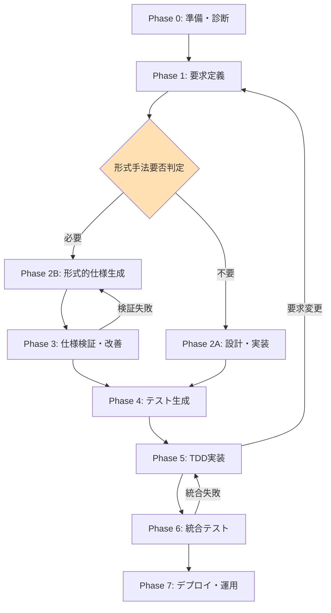
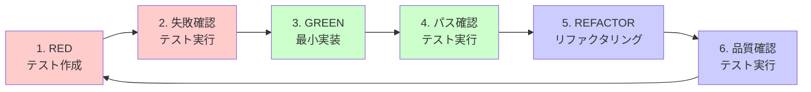
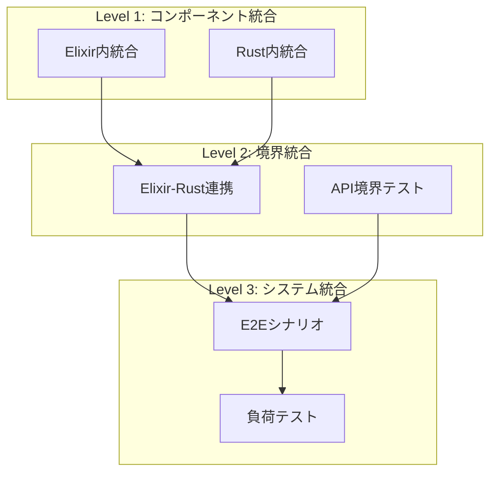
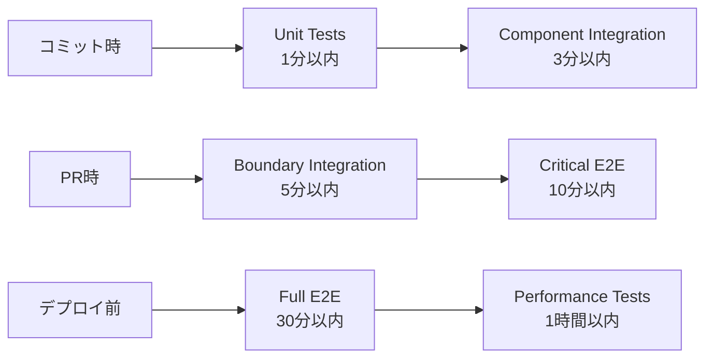

# AIチャット駆動開発完全ガイド

## 1. AIチャット駆動開発プロセス全体フロー

### 1.1 プロセス概要



### 1.2 各フェーズの詳細

#### Phase 0: 準備・診断（30分-2時間）

**目的**: プロジェクトの土台作成と適切な手法の選択

**AIとの対話例**:
```
ユーザー: 「ゼロ知識証明を使ったじゃんけんゲームを作りたい」

AI: プロジェクトを診断します。以下を教えてください：
1. システムの重要度（POC/業務/ミッションクリティカル）
2. 並行性・分散性の度合い
3. セキュリティ要件（暗号処理の有無）
4. チームのスキルセット
5. 技術的制約

診断結果：
- 推奨開始手法：Level 0-1（基本＋BDD）
- 暗号部分：Level 4（Dafny）を推奨
- 実装言語：制約に応じて提案
```

**成果物**:
- プロジェクト診断結果
- 形式手法の選択計画
- 初期要求リスト

#### Phase 1: 要求定義（1-3時間）

**目的**: ビジネス要求の明確化（形式手法のレベルに応じた記述）

**AIとの対話例**:
```
ユーザー: 「じゃんけんの基本フローを定義したい」

AI: 診断結果に基づいて以下を作成します：
- Level 0: 自然言語での要求記述
- Level 1選択時: BDDシナリオ追加

Scenario: 正常なじゃんけん対戦
  Given プレイヤー2人がマッチング済み
  When 両プレイヤーが手を選択し提出
  Then 勝敗が判定され結果が表示される
```

**成果物**:
- 要求仕様書（選択したレベルに応じた形式）
- 受け入れ条件リスト

#### Phase 2A: 設計・実装（形式手法不要の場合）

**目的**: 通常の設計と実装

**AIとの対話例**:
```
ユーザー: 「アーキテクチャ設計を進めたい」

AI: 形式手法を使わない開発を進めます：
- アーキテクチャ設計
- API設計
- データモデル設計
直接実装フェーズへ
```

#### Phase 2B: 形式的仕様生成（必要な場合のみ）

**目的**: 選択された形式手法での仕様作成

**AIとの対話例**:
```
ユーザー: 「診断でLevel 3, 4が推奨された部分の仕様を作成」

AI: 必要な部分のみ形式化します：
- Level 3選択: TLA+で並行処理部分のみモデル化
- Level 4選択: Dafnyで暗号処理のみ仕様化
- その他: 通常の設計文書
```

**成果物**:
- 必要最小限の形式的仕様
- 実装言語への変換ガイド下のシナリオを作成しました：

Scenario: 正常なじゃんけん対戦
  Given プレイヤー2人がマッチング済み
  When 両プレイヤーが手を選択し提出
  Then 勝敗が判定され結果が表示される
```

**成果物**:
- BDD要求仕様書（Feature/Scenario形式）
- 受け入れ条件リスト

#### Phase 2: 形式的仕様生成（2-4時間）

**目的**: BDD仕様から TLA+/Dafny の形式的仕様を生成

**AIとの対話例**:
```
ユーザー: 「このBDD仕様からTLA+仕様を生成して」

AI: TLA+/Elixir と Dafny/Rust の分割を行います：
- TLA+: ゲームセッション管理、タイムアウト処理
- Dafny: 暗号学的操作、勝敗判定ロジック
```

**成果物**:
- TLA+仕様書
- Dafny仕様書
- 領域分割設計書

#### Phase 3: 仕様検証・改善（1-2時間）

**目的**: 生成された仕様の正確性・完全性を検証

**AIとの対話例**:
```
ユーザー: 「TLA+仕様の型不変条件をチェックして」

AI: 以下の問題を発見しました：
1. プレイヤー状態遷移に不整合
2. タイムアウト処理の欠落
修正版を提示します...
```

**成果物**:
- 検証済み形式的仕様
- 検証レポート

#### Phase 4: テスト生成（2-3時間）

**目的**: 仕様から包括的なテストスイートを生成

**AIとの対話例**:
```
ユーザー: 「Dafny仕様から Rust のユニットテストを生成して」

AI: 以下のテストを生成しました：
- 正常系テスト: 15件
- 境界値テスト: 8件
- エラーケース: 10件
```

**成果物**:
- ユニットテストコード
- プロパティテストコード
- 統合テストシナリオ

#### Phase 5: TDD実装（実装規模による）

**目的**: テスト駆動で実装を進める

**詳細は次章「2. TDD実践ガイド」参照**

#### Phase 6: 統合テスト（1-2時間）

**目的**: システム全体の動作確認

**詳細は「3. 統合テスト実施ガイド」参照**

#### Phase 7: デプロイ・運用（30分-1時間）

**目的**: 本番環境へのデプロイと運用開始

### 1.3 フェーズ間の移行基準

| フェーズ | 次フェーズへの移行条件 | 品質ゲート |
|---------|------------------------|-------------|
| Phase 0→1 | 要求の明確化完了 | ステークホルダー合意 |
| Phase 1→2 | BDD仕様の完成 | シナリオカバレッジ90% |
| Phase 2→3 | 形式的仕様の生成 | 構文エラーなし |
| Phase 3→4 | 仕様検証合格 | 整合性スコア80%以上 |
| Phase 4→5 | テスト生成完了 | テストカバレッジ95% |
| Phase 5→6 | 実装完了 | 全ユニットテスト合格 |
| Phase 6→7 | 統合テスト合格 | E2Eテスト100%合格 |

## 2. TDD実践ガイド

### 2.1 TDDサイクルの基本



### 2.2 各ステップの詳細実践

#### ステップ1: RED - テスト作成

**目的**: 実装前に期待動作を定義

**AIとの対話パターン**:
```
ユーザー: 「commitment作成機能のテストを書きたい」

AI: 以下のテストを提案します：

#[test]
fn test_create_commitment() {
    // Arrange
    let move_val = 1; // グー
    let nonce = 12345;
    
    // Act
    let commitment = create_commitment(move_val, nonce);
    
    // Assert
    assert_eq!(commitment.len(), 64);
    assert_ne!(commitment, "");
}
```

**チェックポイント**:
- [ ] テストが仕様を正確に反映している
- [ ] テスト名が意図を明確に表現している
- [ ] Arrange-Act-Assert パターンに従っている

#### ステップ2: 失敗確認

**目的**: テストが正しく失敗することを確認

**AIとの対話パターン**:
```
ユーザー: 「このテストを実行したら『create_commitment関数が未定義』エラーが出た」

AI: 正常です。これは期待される失敗です。
次に最小限の実装を作成しましょう。
```

**確認事項**:
- コンパイルエラー（関数未定義）
- 実行時エラー（未実装）
- アサーションエラー（誤った結果）

#### ステップ3: GREEN - 最小実装

**目的**: テストを通す最小限のコード作成

**AIとの対話パターン**:
```
ユーザー: 「create_commitment関数の最小実装を作って」

AI: テストを通すための最小実装：

fn create_commitment(move_val: u8, nonce: u64) -> String {
    // 最小実装：固定長の文字列を返す
    "0".repeat(64)
}
```

**原則**:
- 過度な設計を避ける
- テストを通すことだけに集中
- 後でリファクタリングすることを前提

#### ステップ4: パス確認

**目的**: テストが成功することを確認

**AIとの対話パターン**:
```
ユーザー: 「テストが通った。次は？」

AI: 素晴らしい！次により現実的なテストケースを追加しましょう：
- 異なる入力での結果の違い
- エッジケース
- エラーケース
```

#### ステップ5: REFACTOR - リファクタリング

**目的**: コードの品質向上（動作は変えない）

**AIとの対話パターン**:
```
ユーザー: 「create_commitment の実装を改善したい」

AI: 以下のリファクタリングを提案：

fn create_commitment(move_val: u8, nonce: u64) -> String {
    use sha2::{Sha256, Digest};
    
    let mut hasher = Sha256::new();
    hasher.update(&[move_val]);
    hasher.update(&nonce.to_le_bytes());
    
    format!("{:x}", hasher.finalize())
}
```

**リファクタリング観点**:
- コードの重複除去
- 可読性向上
- パフォーマンス改善
- 設計パターン適用

#### ステップ6: 品質確認

**目的**: リファクタリング後も動作が変わらないことを確認

### 2.3 TDDのベストプラクティス

#### テストの粒度

```yaml
unit_test_granularity:
  tiny: "1つの関数の1つの振る舞い"
  small: "1つのクラスの公開メソッド"
  medium: "複数クラスの協調動作"
  
recommended_distribution:
  tiny: 60%
  small: 30%
  medium: 10%
```

#### テスト命名規則

```
テスト名 = [テスト対象]_[条件]_[期待結果]

例:
- create_commitment_with_valid_input_returns_64_char_hash
- judge_moves_with_same_moves_returns_draw
- verify_proof_with_invalid_proof_returns_error
```

#### AIとの効果的な対話

**良い質問例**:
```
✅ 「この関数の境界値テストケースを提案して」
✅ 「このテストが失敗する実装のバグを見つけて」
✅ 「このコードのテスタビリティを改善する方法は？」
```

**避けるべき質問例**:
```
❌ 「全部のテストを書いて」（粒度が大きすぎる）
❌ 「正しい実装を教えて」（TDDの順序が逆）
❌ 「テストなしで実装したい」（TDDの原則違反）
```

### 2.4 TDD実装フロー例

```markdown
## じゃんけん判定機能のTDD実装

### サイクル1: 基本的な勝敗判定

1. **RED**: グーがチョキに勝つテスト作成
   ```rust
   #[test]
   fn test_rock_beats_scissors() {
       assert_eq!(judge_moves(ROCK, SCISSORS), WIN);
   }
   ```

2. **失敗確認**: judge_moves未定義エラー

3. **GREEN**: 最小実装
   ```rust
   fn judge_moves(p1: Move, p2: Move) -> Result {
       WIN  // とりあえず勝ちを返す
   }
   ```

4. **パス確認**: テスト成功

5. **REFACTOR**: より汎用的な実装へ
   ```rust
   fn judge_moves(p1: Move, p2: Move) -> Result {
       match (p1, p2) {
           (ROCK, SCISSORS) => WIN,
           _ => DRAW,
       }
   }
   ```

### サイクル2: 引き分けケース追加
（同様のサイクルを繰り返す）

### サイクル3: 全パターン網羅
（9パターンすべてをカバー）
```

## 3. 統合テスト実施ガイド

### 3.1 統合テストの階層



### 3.2 統合テスト設計

#### Level 1: コンポーネント統合テスト

**目的**: 同一技術スタック内の統合確認

**Elixir側の例**:
```elixir
describe "GameSession and MatchmakingQueue integration" do
  test "matched players are correctly assigned to session" do
    # Arrange
    {:ok, queue} = MatchmakingQueue.start_link()
    {:ok, session} = GameSession.start_link()
    
    # Act
    MatchmakingQueue.add_player(queue, player1)
    MatchmakingQueue.add_player(queue, player2)
    
    # Assert
    assert GameSession.get_players(session) == [player1, player2]
  end
end
```

**Rust側の例**:
```rust
#[test]
fn test_proof_generation_and_verification_integration() {
    // Arrange
    let move_val = 1;
    let nonce = 12345;
    
    // Act
    let commitment = create_commitment(move_val, nonce);
    let proof = generate_proof(move_val, nonce, &commitment);
    let result = verify_proof(&proof, &commitment);
    
    // Assert
    assert!(result.is_ok());
}
```

#### Level 2: 境界統合テスト

**目的**: 異なる技術スタック間の連携確認

**AIとの対話例**:
```
ユーザー: 「Elixir から Rust の暗号関数を呼ぶ統合テストを作って」

AI: NIF（Native Implemented Function）経由の統合テスト：

defmodule CryptoIntegrationTest do
  test "Elixir calls Rust crypto functions via NIF" do
    # Arrange
    move_val = 1
    nonce = 12345
    
    # Act - Rust関数呼び出し
    {:ok, commitment} = RustCrypto.create_commitment(move_val, nonce)
    
    # Assert
    assert byte_size(commitment) == 32
    assert is_binary(commitment)
  end
end
```

**テスト観点**:
- データ型変換の正確性
- エラー伝播の適切性
- パフォーマンス劣化の確認
- メモリリークの検出

#### Level 3: システム統合テスト

**目的**: エンドツーエンドの動作確認

**E2Eシナリオテスト例**:
```gherkin
Feature: Complete game flow
  
  Scenario: Two players complete a game
    Given two players are registered
    When player1 joins the game queue
    And player2 joins the game queue
    And both players are matched
    And player1 submits rock with commitment
    And player2 submits scissors with commitment
    And both players reveal their moves
    Then player1 should be declared winner
    And game history should be recorded
    And both players can start a new game
```

### 3.3 統合テスト実行戦略

#### 環境構成

```yaml
test_environments:
  local:
    description: "開発者ローカル環境"
    scope: "基本的な統合テスト"
    data: "モックデータ"
    
  ci:
    description: "CI/CD環境"
    scope: "全統合テスト"
    data: "テスト専用DB"
    
  staging:
    description: "ステージング環境"
    scope: "本番相当テスト"
    data: "本番類似データ"
```

#### 実行順序とタイミング



### 3.4 統合テストのトラブルシューティング

#### よくある問題と対処法

| 問題 | 原因 | 対処法 | AIへの質問例 |
|------|------|--------|--------------|
| テストが不安定 | 非同期処理の競合 | 適切な待機処理追加 | 「このテストを安定化する方法は？」 |
| 実行時間が長い | 不要な待機・DB操作 | 並列実行・モック活用 | 「このテストを高速化する方法は？」 |
| 環境依存エラー | 設定・依存の差異 | Docker化・設定外部化 | 「環境差異を吸収する方法は？」 |
| データ競合 | テスト間の干渉 | データ分離・クリーンアップ | 「テストデータを分離する方法は？」 |

## 4. BDD要求仕様記述ガイド

### 4.1 効果的なFeature記述

#### 基本構造

```gherkin
Feature: [機能名]
  As a [ユーザー種別]
  I want [実現したいこと]
  So that [ビジネス価値]
  
  Background:
    Given [すべてのシナリオ共通の前提条件]
  
  Scenario: [シナリオ名]
    Given [前提条件]
    When [アクション]
    Then [期待結果]
```

#### 良い例と悪い例

**良い例 ✅**:
```gherkin
Scenario: プレイヤーが制限時間内に手を提出
  Given プレイヤーがゲームセッションに参加済み
  And 制限時間が30秒に設定されている
  When プレイヤーが「グー」を選択
  And 10秒後に提出ボタンを押す
  Then 手の提出が正常に受理される
  And 「提出完了」メッセージが表示される
```

**悪い例 ❌**:
```gherkin
Scenario: ゲームする
  Given ユーザーがいる
  When 何かする
  Then うまくいく
```

### 4.2 仕様の粒度管理

```yaml
specification_granularity:
  epic:
    description: "大規模機能群"
    example: "ゼロ知識じゃんけんゲーム"
    scenarios: 20-50
    
  feature:
    description: "機能単位"
    example: "マッチメイキング機能"
    scenarios: 5-15
    
  scenario:
    description: "具体的な使用例"
    example: "2人のプレイヤーがマッチング"
    steps: 3-10
```

## 5. AIとの対話テンプレート集

### 5.1 フェーズ別対話テンプレート

#### Phase 1: BDD要求仕様作成

```markdown
## 基本的な機能要求の引き出し
「[機能名]について、以下の観点でBDDシナリオを作成してください：
- 正常系の基本フロー
- 主要な異常系（3パターン）
- エッジケース（2パターン）」

## 受け入れ条件の明確化
「このシナリオの受け入れ条件を、測定可能な形で定義してください」

## シナリオの詳細化
「このシナリオのGiven句をより具体的にしてください。
特にデータの初期状態を明確にしてください」
```

#### Phase 2: 形式的仕様生成

```markdown
## TLA+/Dafny分割の決定
「このBDD仕様を分析して、TLA+で記述すべき部分とDafnyで記述すべき部分を分けてください」

## TLA+仕様の生成
「以下のBDDシナリオからTLA+仕様を生成してください：
- 並行性の観点を重視
- タイムアウト処理を含める
- 活性条件を明示」

## Dafny仕様の生成
「以下の処理についてDafny契約を生成してください：
- 事前条件・事後条件を明確に
- 不変条件を定義
- 型安全性を保証」
```

#### Phase 3: 仕様検証

```markdown
## 整合性チェック
「TLA+仕様とDafny仕様の間で、状態表現と操作の対応関係をチェックしてください」

## 完全性チェック
「この仕様がBDD要求をすべてカバーしているか確認してください。
カバーされていない要求があれば指摘してください」

## 実装可能性チェック
「この仕様が実際に実装可能か、技術的な観点から評価してください」
```

#### Phase 4: テスト生成

```markdown
## ユニットテスト生成
「このDafny契約から、Rustのユニットテストを生成してください。
正常系、境界値、異常系を網羅してください」

## プロパティテスト生成
「このTLA+不変条件から、プロパティベーステストを生成してください」

## 統合テストシナリオ
「システム境界でのデータフローを確認する統合テストを設計してください」
```

#### Phase 5: TDD実装

```markdown
## 次のテストケース提案
「現在のテストカバレッジを踏まえて、次に書くべきテストを提案してください」

## 最小実装の作成
「このテストを通すための最小限の実装を提供してください」

## リファクタリング提案
「このコードの可読性と保守性を改善する方法を提案してください」
```

### 5.2 トラブルシューティング用対話

```markdown
## テスト失敗の原因分析
「このテストが失敗しています。エラーメッセージは[エラー内容]です。
考えられる原因と対処法を教えてください」

## パフォーマンス問題
「この処理が遅いです。プロファイル結果は[結果]です。
最適化の方法を提案してください」

## 設計の改善
「この設計に違和感があります。[懸念点]
より良い設計パターンを提案してください」
```

### 5.3 品質向上のための対話

```markdown
## コードレビュー依頼
「このコードをレビューしてください。
特に[観点]について重点的に見てください」

## ベストプラクティス確認
「この実装は[言語/フレームワーク]のベストプラクティスに従っていますか？」

## セキュリティチェック
「このコードにセキュリティ上の問題がないか確認してください」
```

## 6. 品質保証チェックリスト

### 6.1 フェーズ完了基準

#### Phase 1 完了基準
- [ ] すべての主要機能にBDDシナリオがある
- [ ] 各シナリオに受け入れ条件が定義されている
- [ ] ステークホルダーのレビュー完了

#### Phase 2 完了基準
- [ ] TLA+仕様の構文チェック合格
- [ ] Dafny仕様の型チェック合格
- [ ] 領域分割の妥当性確認

#### Phase 3 完了基準
- [ ] 仕様間の整合性スコア80%以上
- [ ] 要求カバレッジ90%以上
- [ ] 実装可能性の確認

#### Phase 4 完了基準
- [ ] テストカバレッジ95%以上
- [ ] すべてのテストが実行可能
- [ ] CI/CDへの統合完了

#### Phase 5 完了基準
- [ ] すべてのユニットテスト合格
- [ ] コードカバレッジ90%以上
- [ ] リファクタリング完了

#### Phase 6 完了基準
- [ ] すべての統合テスト合格
- [ ] E2Eシナリオ100%成功
- [ ] パフォーマンス基準達成

### 6.2 継続的改善指標

```yaml
quality_metrics:
  process_efficiency:
    cycle_time: "要求から実装までの時間"
    rework_rate: "手戻り発生率"
    automation_rate: "自動化率"
    
  code_quality:
    test_coverage: "> 95%"
    code_complexity: "< 10"
    duplication: "< 5%"
    
  specification_quality:
    ambiguity_score: "< 0.1"
    completeness: "> 95%"
    consistency: "> 90%"
```

## 7. プロジェクト規模別ガイドライン

### 7.1 小規模プロジェクト（1-2週間）

```yaml
small_project:
  team_size: 1-2人
  features: 3-5個
  
  time_allocation:
    planning: 10%
    specification: 20%
    implementation: 50%
    testing: 20%
    
  simplifications:
    - BDD: 主要シナリオのみ
    - 形式的仕様: 重要部分のみ
    - テスト: ユニットテスト中心
```

### 7.2 中規模プロジェクト（1-3ヶ月）

```yaml
medium_project:
  team_size: 3-5人
  features: 10-20個
  
  time_allocation:
    planning: 15%
    specification: 25%
    implementation: 40%
    testing: 20%
    
  full_process:
    - BDD: 全機能カバー
    - 形式的仕様: TLA+とDafny両方
    - テスト: 全レベル実施
```

### 7.3 大規模プロジェクト（3ヶ月以上）

```yaml
large_project:
  team_size: 5人以上
  features: 20個以上
  
  time_allocation:
    planning: 20%
    specification: 30%
    implementation: 35%
    testing: 15%
    
  additional_practices:
    - アーキテクチャ検証
    - パフォーマンステスト
    - セキュリティ監査
    - 段階的リリース
```

## 8. よくある課題と対処法

### 8.1 仕様作成の課題

| 課題 | 症状 | 対処法 |
|------|------|--------|
| 仕様の曖昧性 | AIが異なる解釈をする | 具体例を追加、数値化 |
| 仕様の不完全性 | エッジケース未考慮 | 体系的なケース分析 |
| 仕様の不整合 | TLA+とDafnyが矛盾 | 境界定義の明確化 |

### 8.2 実装の課題

| 課題 | 症状 | 対処法 |
|------|------|--------|
| テスト作成の遅延 | 実装が先行 | TDD原則の徹底 |
| リファクタリング不足 | 技術的負債蓄積 | 定期的なコードレビュー |
| 統合の困難 | 境界でのエラー多発 | インターフェース仕様強化 |

### 8.3 プロセスの課題

| 課題 | 症状 | 対処法 |
|------|------|--------|
| AIとの対話効率 | 質問の繰り返し | テンプレート活用 |
| 品質基準の未達 | カバレッジ不足 | 段階的な基準引き上げ |
| 進捗の遅延 | 見積もり超過 | バッファ時間の確保 |

## まとめ

このガイドに従うことで、AIチャットを活用した体系的な開発プロセスを実現できます。

### 成功のポイント

1. **段階的アプローチ**: 各フェーズを着実に完了
2. **品質ゲート**: 次フェーズへの移行基準を厳守
3. **継続的対話**: AIとの効果的なコミュニケーション
4. **測定と改善**: メトリクスに基づく継続的改善

### 期待される成果

- **開発速度**: 従来比 2-3倍の高速化
- **品質向上**: バグ密度 90%削減
- **保守性**: 技術的負債の最小化
- **知識蓄積**: 仕様と実装の完全な対応

このプロセスにより、理論的正しさと実用性を両立した高品質なソフトウェアを効率的に開発できます。

---

**作成日**: 2025年8月8日  
**バージョン**: 1.0