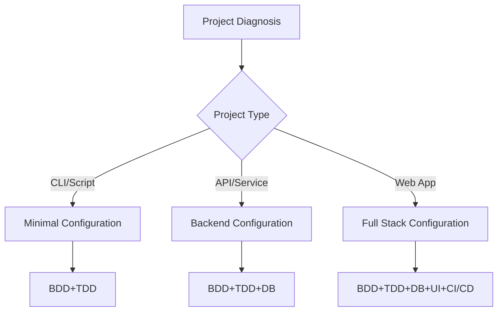
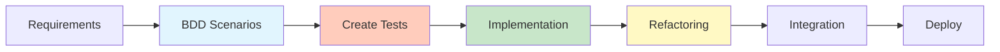

# AI Chat-Driven Development Unified Guide v2.1

## 📌 About This Guide

A unified guide for completing everything from requirements definition to production deployment through dialogue with AI chat (Claude, etc.) only. Centered on BDD+TDD, with selective use of formal methods as needed.

**v2.1 New Feature**: Efficient start with project diagnosis interview sheet ⭐

## 🚀 Quick Start

### Method 1: Using Interview Sheet (Recommended) ⭐

```markdown
1. Input the following to AI chat:
   "Display project diagnosis interview sheet"
2. Fill out the sheet (5-10 minutes)
3. Submit completed sheet to AI:
   "Please diagnose based on this interview sheet and start development"
```

### Method 2: 30-Second Start (Dialogue Format)

```markdown
1. Open AI chat (Claude/Claude Code)
2. Input this guide
3. Execute the following:

"I want to start a project.
I want to create [your idea].
Please start with diagnosis."
```

## 📊 Project Diagnosis Flow

### Phase 0: Automatic Diagnosis (5-30 minutes)

#### Method 1: Using Interview Sheet (Recommended) ⭐
```markdown
"Please display the project diagnosis interview sheet"

→ Fill out sheet (5-10 minutes)
→ Submit to AI
→ Immediate diagnosis results
```

#### Method 2: Dialogue Format
```markdown
"Please diagnose the following project:

Overview: [1-2 sentence explanation]
Importance: [hobby/business/mission-critical]
Scale: [individual/team/large-scale]"
```

#### AI Diagnosis Items

```yaml
diagnosis_result:
  risk_level: [low/medium/high]
  technical_configuration:
    - type: [CLI/API/Web app/Mobile]
    - db_necessity: [not needed/lightweight/full-featured]
    - ui_necessity: [not needed/simple/rich]
  
  recommended_methods:
    required: 
      - BDD (behavior specification)
      - TDD (test-driven development)
    optional:
      - Type system (complex data)
      - Model checking (with concurrency)
      - Formal proof (crypto/finance only)
  
  technology_stack:
    language: [AI suggests or team specifies]
    framework: [as needed]
    infrastructure: [local/cloud]
```

### Branching by Diagnosis



## 🔄 Development Cycle

### Basic Cycle (Common to All Projects)



### Phase 1: BDD Requirements Definition

#### Basic Template
```gherkin
Feature: [Feature name]
  As a [User type]
  I want [What to do]
  So that [Why needed]

  Scenario: [Scenario name]
    Given [Preconditions]
    When [Action]
    Then [Expected result]
```

#### Layered BDD Scenarios

**Business Logic Layer**
```gherkin
Scenario: Game win/loss judgment
  Given Player 1 has "Rock"
  And Player 2 has "Scissors"
  When judgment is made
  Then Player 1 wins
```

**Database Layer** (when needed)
```gherkin
Scenario: Result persistence
  Given game result is determined
  When saved to database
  Then accessible from history
```

**UI Layer** (when needed)
```gherkin
Scenario: Result display
  Given game is finished
  When result screen is displayed
  Then win/loss is shown with animation
```

### Phase 2-4: TDD Cycle

#### Execution Method by Environment

**Chat Environment (Code generation only)**
```markdown
1. AI: "Generate test code"
2. Human: Copy and execute manually
3. AI: "Generate implementation"
4. Human: Execute and confirm
```

**Workspace Environment (Automatic execution)**
```markdown
1. AI: Create test → Auto execute → Confirm failure
2. AI: Create implementation → Auto execute → Confirm success
3. AI: Refactoring → Auto re-test
```

#### TDD Example

```python
# Cycle 1: RED
def test_judge_game():
    assert judge_game("rock", "scissors") == "player1"  # Fails

# Cycle 2: GREEN
def judge_game(p1, p2):
    return "player1"  # Minimal implementation

# Cycle 3: REFACTOR
def judge_game(p1, p2):
    rules = {
        ("rock", "scissors"): "player1",
        ("scissors", "paper"): "player1",
        ("paper", "rock"): "player1",
    }
    return rules.get((p1, p2), "player2")
```

## 🏗️ Project Configuration Patterns

### Pattern 1: Minimal Configuration (CLI/Script)

```
project/
├── src/
│   └── main.py
├── tests/
│   └── test_main.py
└── README.md
```

**Required methods**: BDD+TDD only

### Pattern 2: API Configuration (Backend)

```
project/
├── src/
│   ├── api/
│   ├── models/
│   └── services/
├── tests/
│   ├── unit/
│   └── integration/
├── database/
│   └── migrations/
└── docker-compose.yml
```

**Required methods**: BDD+TDD+DB design

### Pattern 3: Full Stack Configuration

```
project/
├── backend/
│   ├── src/
│   └── tests/
├── frontend/
│   ├── src/
│   └── tests/
├── database/
│   └── migrations/
├── .github/
│   └── workflows/
└── docker-compose.yml
```

**Required methods**: BDD+TDD+DB+UI+CI/CD

## 🎯 Quality Assurance Strategy

### Coverage Goals

| Layer | Minimum | Recommended | Measurement Method |
|-------|---------|-------------|-------------------|
| Unit Tests | 70% | 90% | `pytest --cov` |
| Integration Tests | 50% | 80% | API/DB tests |
| E2E Tests | Main flows | All scenarios | Playwright, etc. |

### Continuous Quality Checks

```yaml
automatic_check_items:
  - test_execution: On every push
  - coverage: Confirm on PR
  - type_check: Static analysis
  - security: Dependency scan
```

## 🔧 Technology Selection Guide

### Language Selection Matrix

| Requirements | Recommended Language | Reason |
|--------------|---------------------|--------|
| **Fast Development** | Python, JavaScript | Rich libraries |
| **Type Safety** | TypeScript, Rust | Compile-time checks |
| **High Performance** | Rust, Go | System-level performance |
| **Concurrency** | Go, Elixir | Built-in support |
| **Web UI** | TypeScript + React/Vue | Ecosystem |

### Database Selection

```yaml
by_use_case:
  simple: SQLite (file DB)
  general: PostgreSQL (RDBMS)
  large_scale: PostgreSQL + Redis
  nosql: MongoDB (document type)
  real_time: Firebase/Supabase
```

## 📝 Effective AI Dialogue

### Good Instruction Examples

```markdown
✅ Specific and step-by-step
"I want to add user authentication feature.
First create BDD scenarios,
then proceed with TDD implementation using JWT."

✅ Clear constraints
"Proceed using Python, FastAPI,
and PostgreSQL connection settings."

✅ Specify quality standards
"Implement with 90%+ coverage,
type hints mandatory."
```

### Instructions to Avoid

```markdown
❌ Vague
"Make a nice app"

❌ Too much at once
"Implement all features at once"

❌ No prerequisites
"Deploy it" (environment unspecified)
```

## 🚦 Phase-by-Phase Checklist

### ✅ Phase 0: Diagnosis
- [ ] Project type determined
- [ ] Technology stack selected
- [ ] Required methods identified

### ✅ Phase 1: Requirements
- [ ] BDD scenarios created
- [ ] Acceptance criteria clarified
- [ ] Priorities determined

### ✅ Phase 2-4: Implementation
- [ ] Test-first enforced
- [ ] Coverage goals achieved
- [ ] Refactoring completed

### ✅ Phase 5: Integration
- [ ] Integration tests performed
- [ ] E2E tests successful
- [ ] Performance confirmed

### ✅ Phase 6: Deploy
- [ ] CI/CD pipeline
- [ ] Environment variables set
- [ ] Monitoring configured

## 🎓 Selective Use of Formal Methods

### When to Use

```yaml
formal_methods_application_criteria:
  
  not_needed (90% of projects):
    - General web applications
    - CRUD-centered
    - UI-focused
    
  consider (8%):
    - Complex concurrency → Model checking
    - Complex data structures → Type system
    
  necessary (2%):
    - Cryptographic implementation → Formal proof
    - Financial calculations → Mathematical proof
    - Life-critical → Complete verification
```

### Gradual Addition

```markdown
Problem: "Deadlock in concurrent processing"
→ AI: "Let's model just this part with TLA+"

Problem: "Uncertain about cryptographic processing correctness"
→ AI: "Let's add proof with Dafny"
```

## 💡 Troubleshooting

### Common Problems and Solutions

| Problem | Cause | Solution |
|---------|-------|----------|
| Test failures | Requirement misunderstanding | Review BDD scenarios |
| Slow development | Excessive formalization | Reduce to necessary minimum |
| Integration errors | Type mismatches | Clarify interfaces |
| Deployment failures | Environment differences | Dockerization |

## 📈 Success Metrics

```yaml
quality_indicators:
  bug_density: < 1/KLOC
  coverage: > 80%
  technical_debt: Minimal

efficiency_indicators:
  development_speed: 2x vs conventional
  rework: < 10%
  automation_rate: > 70%

business_indicators:
  requirement_fulfillment: 100%
  deadline_adherence: 95%
  maintainability: High
```

## 🔄 Continuous Improvement

### Review Template

```markdown
"Please conduct a project review:

Good points:
- [AI analyzes]

Improvement points:
- [AI suggests]

Application to next time:
- [AI plans]"
```

## 📚 Appendix: Minimal Prerequisites

### Required
- Programming basics
- Basic Git operations

### Recommended
- Testing concepts
- Web basics (for web apps)

### Not Required
- Formal methods details
- Deep framework knowledge
- DevOps tool details

---

**Version**: 2.1  
**Last Updated**: August 8, 2025  
**License**: MIT

## Summary

This guide covers everything for AI dialogue-driven development.

**Features**:
1. **Efficient**: 5-10 minute diagnosis with interview sheet
2. **Practical**: BDD+TDD centered and practical
3. **Adaptive**: Method selection according to project
4. **Complete**: CLI to full stack support
5. **Simple**: Minimal necessary documentation

**Usage**:
1. Diagnose with interview sheet (recommended)
2. Or input this guide to AI
3. Explain your project
4. Follow AI instructions for development

That's all.