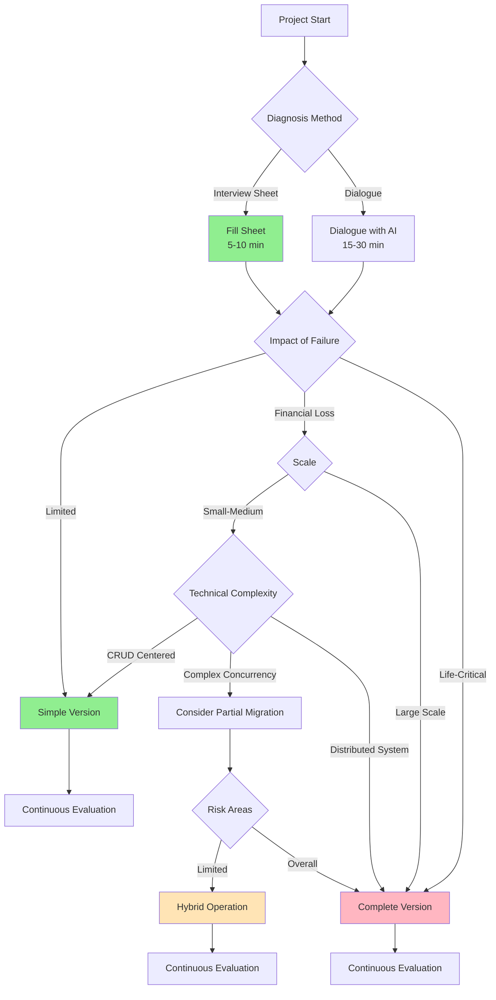

# AI Chat-Driven Development Framework - Complete Documentation System

## 🎯 Framework Overview

### Mission
A complete framework for systematically developing from PoC to high-reliability systems through dialogue with AI chat (Claude, ChatGPT, etc.). Based on BDD (Behavior Driven Development) and TDD (Test Driven Development), with staged application of formal methods as needed.

### Features
- **Efficient Start**: 5-10 minute diagnosis with interview sheet ⭐NEW
- **Adaptive**: Select methods according to project nature
- **Staged**: Seamless transition from simple to complete versions
- **Practical**: Immediately usable in actual development
- **AI Optimized**: Structure specialized for AI dialogue

## 📚 Complete Document System Structure

```
AI Chat-Driven Development Framework v3.1/
│
├── 📄 【Diagnosis Support】Project Diagnosis Interview Sheet ⭐NEW
│   ├── Structured question items
│   ├── Checkbox format
│   ├── Completable in 5-10 minutes
│   └── Supports accurate AI diagnosis
│
├── 📄 【Common】Framework Document System (this document)
│   ├── Overall overview
│   ├── Document list and roles
│   ├── Selection guidelines
│   └── Migration paths
│
├── 📁 Quick Start Edition (Simple Version)/
│   │
│   └── 📄 AI Chat-Driven Development Unified Guide v2.0
│       ├── Use: PoC, prototypes, general applications
│       ├── Methods: BDD+TDD centered
│       ├── Formal methods: Selective (2% of cases only)
│       └── Features: One-document complete, 30-second start
│
└── 📁 Enterprise Edition (Complete Version)/
    │
    ├── 📄 1. Adaptive Formal Methods Selection Framework
    │   ├── Formal methods hierarchy model (Level 0-4)
    │   ├── Project diagnosis protocol
    │   └── Dynamic addition protocol
    │
    ├── 📄 2. AI Chat-Driven Development Complete Guide
    │   ├── Phase 0-7 detailed process
    │   ├── TDD cycle practice
    │   └── Integration test implementation methods
    │
    ├── 📄 3. AI Chat-Driven Formal Specification Development Practice Guide
    │   ├── BDD requirements specification creation
    │   ├── TLA+ specification creation
    │   ├── Dafny specification creation
    │   └── Test generation from specifications
    │
    ├── 📄 4. Formal Specification Correctness Verification Framework
    │   ├── Layer 1-5 verification structure
    │   ├── TLA+/Dafny consistency confirmation
    │   └── Requirements coverage analysis
    │
    ├── 📄 5. Workspace Execution Environment Guide
    │   ├── Project structure standards
    │   ├── TDD cycle execution
    │   └── CI/CD integration
    │
    └── 📄 6. Full Stack Development Integration Guide
        ├── Database persistence
        ├── Frontend development
        ├── API design
        └── Production operation considerations
```

## 🔄 Using the Two Editions

### Quick Start Edition (Simple Version)

#### Target Projects
- Proof of Concept (PoC)
- Prototype development
- Startup initial products
- General web applications
- Internal tools and business systems
- Medium or lower reliability requirements

#### Included Elements
```yaml
required:
  - BDD (Behavior Driven Development)
  - TDD (Test Driven Development)
  - Basic testing strategy

selective:
  - Type-based specification
  - Property Based Testing
  - Simple CI/CD

excluded:
  - TLA+ (temporal logic)
  - Dafny (formal proof)
  - Multi-layer verification process
```

#### Benefits
- **Immediate start**: Project start in 30 seconds
- **Minimal learning cost**: Only BDD+TDD basics
- **Fast development**: 2x development speed vs conventional
- **Practical**: Sufficient for 90% of projects

### Enterprise Edition (Complete Version)

#### Target Projects
- Mission-critical systems
- Financial/banking/payment systems
- Medical devices/healthcare systems
- Aerospace/autonomous driving
- Cryptography/security products
- Regulatory proof requirements
- Complex distributed systems

#### Included Elements
```yaml
foundation:
  - BDD+TDD (same as simple version)
  
additional:
  - TLA+: Formal modeling of concurrency/distribution
  - Dafny: Mathematical proof of algorithms
  - Multi-layer verification: Systematic 5-layer verification
  - Inter-specification consistency: TLA+/Dafny correspondence check
  - Requirements traceability: Complete tracking
```

#### Benefits
- **Mathematical guarantee**: 95% bug reduction rate
- **Regulatory compliance**: Quality assurance through proof
- **Completeness**: Verification of all aspects
- **Reliability**: Mission-critical support

## 📊 Edition Selection Flowchart

### Efficient Diagnosis Method

#### Method 1: Using Interview Sheet (Recommended) ⭐
1. Fill out project diagnosis interview sheet (5-10 minutes)
2. Submit to AI for immediate diagnosis
3. Accurate judgment with structured information

#### Method 2: Dialogue Format
1. Diagnosis through Q&A with AI (15-30 minutes)
2. Provide information step by step
3. Flexible but time-consuming

### Diagnosis Flowchart



## 🚀 Staged Migration Path

### Phase 1: PoC Development (Simple Version)

```yaml
duration: 1 week
documents_used: AI Chat-Driven Development Unified Guide v2.0

deliverables:
  - BDD scenarios: 10-20
  - Unit tests: 50-100
  - Working prototype
  - Basic CI/CD

quality:
  - Test coverage: 70%
  - Bug reduction: 60%
```

### Phase 2: Evaluation and Judgment

```yaml
evaluation_items:
  - Technical complexity confirmation
  - Risk factor identification
  - Regulatory requirement confirmation
  - Team capability assessment

judgment:
  A. Continue simple version → Phase 3A
  B. Partial migration → Phase 3B
  C. Complete migration → Phase 3C
```

### Phase 3A: Productization with Simple Version

```yaml
additional_work: Minimal
existing_assets: 100% utilization

additional_elements:
  - E2E testing
  - Performance testing
  - Security measures
  - Production environment setup
```

### Phase 3B: Partial Migration (Recommended Path)

```yaml
migration_scope: Only high-risk 10-20%
existing_assets: 100% utilization

additional_work:
  - TLA+ specification for critical parts: 3-5 days
  - Dafny specification for crypto parts: 2-3 days
  - Add property tests: 2-3 days
  - CI integration for formal verification: 1 day

final_configuration:
  - 80%: BDD+TDD (simple version)
  - 20%: Formal methods (critical parts)
```

### Phase 3C: Complete Migration

```yaml
migration_scope: Entire system
existing_assets: 100% utilization (expanded and reinforced)

additional_work:
  - Overall TLA+ modeling: 2-3 weeks
  - Complete Dafny contract definition: 1-2 weeks
  - Multi-layer verification implementation: 1 week
  - Documentation preparation: 1 week

final_configuration:
  - Complete formal methods application
  - Mathematical proof guarantees
```

## 📋 Detailed Document Descriptions

### Simple Version Documents

#### AI Chat-Driven Development Unified Guide v2.0

**Structure**:
1. Quick start (30-second start)
2. Project diagnosis flow
3. BDD requirements definition
4. TDD cycle
5. Project configuration patterns
6. Quality assurance strategy
7. Troubleshooting

**Features**:
- Complete in one document
- Rich practical examples
- Minimal formal methods
- Immediately usable

### Complete Version Document Set

#### 1. Adaptive Formal Methods Selection Framework

**Content**:
- Level 0-4 formal methods hierarchy
- Project diagnosis protocol
- Dynamic addition protocol
- Language-independent implementation strategies

**Usage timing**:
- Phase 0: Initial diagnosis
- Method addition judgment when problems occur

#### 2. AI Chat-Driven Development Complete Guide

**Content**:
- Phase 0-7 detailed process
- Deliverables for each phase
- Detailed TDD cycles
- Integration test strategies

**Usage timing**:
- All development phases
- Process management

#### 3. AI Chat-Driven Formal Specification Development Practice Guide

**Content**:
- BDD specification creation methods
- TLA+ specification creation
- Dafny specification creation
- Specification verification methods

**Usage timing**:
- Phase 1-3: Specification creation
- Phase 4: Verification

#### 4. Formal Specification Correctness Verification Framework

**Content**:
- 5-layer verification structure
- Automatic verification scripts
- Consistency checks
- Coverage analysis

**Usage timing**:
- Phase 3: Specification verification
- Continuous quality confirmation

#### 5. Workspace Execution Environment Guide

**Content**:
- Project structure
- File management
- Test auto-execution
- CI/CD setup

**Usage timing**:
- When using Claude Code, etc.
- Implementation phases

#### 6. Full Stack Development Integration Guide

**Content**:
- DB design and TDD
- Frontend development
- API design
- Production operations

**Usage timing**:
- Web application development
- Full stack configurations

## 🎯 Practical Usage Methods

### New Project Start (Recommended Flow)

```markdown
# Step 1: Open AI chat (Claude recommended)

# Step 2: Diagnose with interview sheet (recommended) ⭐
"Please display the project diagnosis interview sheet"

→ Fill sheet (5-10 minutes)
→ Submit with following template:

"Please diagnose based on the following interview sheet
and start development with appropriate edition.

[Completed interview sheet]"

# Or diagnose through dialogue
"I want to start a new project.
Overview: [your idea]
Importance: [low/medium/high]
Deadline: [period]

Please diagnose the appropriate edition."

# Step 3: Start according to recommendation
For simple version:
"Start based on AI Chat-Driven Development Unified Guide v2.0"

For complete version:
"Start with complete 6-document set including formal methods"
```

### Existing Project Evaluation

```markdown
"I'm considering strengthening an existing project.

Current status:
- Using: Simple version
- Developed: [deliverables list]
- Problems: [specific problems]

Please diagnose whether partial or complete migration is needed."
```

### Migration Implementation

```markdown
"Implementing partial migration.

Target: [migration target modules]
Reason: [migration reasons]

While maintaining the following:
- BDD scenarios
- Test code
- Implementation

Please teach the procedure to add formal methods."
```

## 📊 Selection Criteria Matrix

| Project Characteristics | Simple | Partial Migration | Complete | Reason |
|------------------------|---------|------------------|----------|---------|
| **PoC/MVP** | ◎ | - | - | Speed priority |
| **General Web Apps** | ◎ | △ | - | Sufficient quality |
| **Internal Systems** | ◎ | ○ | - | Cost efficiency |
| **E-commerce Sites** | ○ | ◎ | △ | Strengthen payment parts only |
| **Banking Systems** | - | ○ | ◎ | Regulatory requirements |
| **Medical Systems** | - | △ | ◎ | Life priority |
| **Games (with billing)** | ○ | ◎ | △ | Strengthen billing parts |
| **IoT Devices** | ○ | ◎ | ○ | Security focus |
| **Blockchain** | - | ○ | ◎ | Cryptographic accuracy |
| **AI/ML Systems** | ◎ | ○ | △ | Data processing focused |

Legend: ◎Optimal ○Suitable △Excessive -Not recommended

## 💡 Best Practices for Success

### Principles

1. **Start Simple**: Always begin with simple version
2. **Evolve Gradually**: Strengthen step by step as needed
3. **Reuse Everything**: Utilize 100% of existing assets
4. **Measure Continuously**: Continuously evaluate and adjust
5. **Avoid Over-Engineering**: Avoid excessive formalization

### Anti-patterns

❌ **Start with Complete Version**
- Problem: Excessive initial investment
- Solution: Start with simple version

❌ **Complete Migration**
- Problem: Discarding existing assets
- Solution: Prioritize partial migration

❌ **Forcing Formal Methods**
- Problem: Team resistance
- Solution: Demonstrate necessity first

## 📈 Expected Outcomes

### When Using Simple Version

```yaml
development_efficiency:
  speed_improvement: 2x
  rework_reduction: 50%
  
quality:
  bug_reduction: 60%
  test_coverage: 80%
  
cost:
  development_period: 50% shorter
  maintenance_cost: 30% reduction
```

### When Using Complete Version

```yaml
quality_assurance:
  bug_reduction: 95%
  mathematical_proof: Complete
  
reliability:
  system_downtime: Nearly zero
  data_inconsistency: None
  
regulatory_compliance:
  audit_requirements: Complete fulfillment
  proof_documents: Auto-generated
```

## 🔧 Technical Support

### AI Chat Question Examples

```markdown
# Diagnosis/Selection
"Which edition is suitable for this project?"

# Migration consultation
"When should I migrate from simple to partial version?"

# Technical questions
"How to detect deadlocks with TLA+?"

# Troubleshooting
"Data inconsistency in concurrent processing. Can formal methods solve this?"
```

### Continuous Support

- Project diagnosis: AI performs automatically
- Method selection: AI provides optimal suggestions
- Problem solving: AI provides step-by-step support
- Quality improvement: AI continuously suggests

## 🎓 Required Prerequisites

### Required for Simple Version

- Programming basics
- Basic testing concepts
- Git operations

### Additionally Recommended for Complete Version

- Concurrency basics
- Distributed system concepts
- Mathematical thinking (AI assists)

### Unnecessary Knowledge

- TLA+/Dafny details (AI generates)
- Formal methods theory (AI explains)
- Complex mathematics (AI proves)

## 📅 Roadmap

### Week 1: PoC
- Start with simple version
- Create BDD scenarios
- Implement basic functions

### Week 2-4: Prototype
- Expand functions
- Identify problems
- Migration judgment

### Month 2-3: Productization
- Partial migration as needed
- Quality strengthening
- Production preparation

### Continuous Improvement
- Regular evaluation
- Gradual strengthening
- Optimization

## 🚦 Start Now in 3 Steps

### 1️⃣ Select Diagnosis Method
```
Option A: "Display project diagnosis interview sheet" (recommended) ⭐
Option B: "I want to start development with this framework" (dialogue format)
```

### 2️⃣ Provide Project Information
```
Option A: Fill interview sheet (5-10 minutes) → Submit to AI
Option B: Answer AI questions
```

### 3️⃣ Start Development Based on Diagnosis Results
```
"Start development based on diagnosis results"
```

---

## 📌 Summary

This framework is a complete development system that can grow stepwise from **simple PoC to complex high-reliability systems**.

**Features**:
- 🚀 **Quick start with simple version** (30 seconds)
- 📈 **Gradual strengthening as needed**
- ♻️ **100% utilization of existing assets**
- 🎯 **Achieve optimal quality level**
- 🤖 **AI supports entire process**

**Keys to Success**:
1. Build first (simple version)
2. Find problems
3. Strengthen only necessary parts
4. Continuously improve

---

**Framework Version**: 3.0  
**Created**: 2025  
**License**: MIT  
**Support**: Ask directly in AI chat

## Appendix: Document List Quick Reference

| # | Document Name | Edition | Main Use |
|---|---------------|---------|----------|
| 0 | Framework Document System (this document) | Common | Overall understanding/selection |
| 1 | AI Chat-Driven Development Unified Guide v2.0 | Simple | PoC/general development |
| 2 | Adaptive Formal Methods Selection Framework | Complete | Method selection/diagnosis |
| 3 | AI Chat-Driven Development Complete Guide | Complete | Process management |
| 4 | AI Chat-Driven Formal Specification Development Practice Guide | Complete | Specification creation |
| 5 | Formal Specification Correctness Verification Framework | Complete | Specification verification |
| 6 | Workspace Execution Environment Guide | Complete | Execution environment |
| 7 | Full Stack Development Integration Guide | Complete | Web development |

**Usage**: Tell AI "Refer to document #○" and the corresponding document content will be presented.