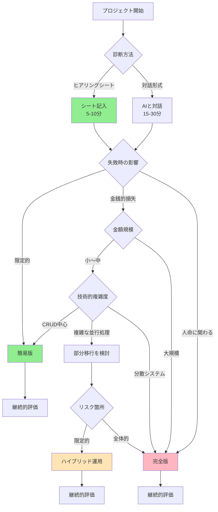

# AIチャット駆動開発フレームワーク - 文書体系完全版

## 🎯 フレームワーク概要

### ミッション
AIチャット（Claude、ChatGPT等）との対話により、PoCから高信頼性システムまで体系的に開発するための完全なフレームワークです。BDD（振る舞い駆動開発）とTDD（テスト駆動開発）を基盤とし、必要に応じて形式手法を段階的に適用します。

### 特徴
- **効率的な開始**: ヒアリングシートで5-10分の診断 ⭐NEW
- **適応的**: プロジェクトの性質に応じて手法を選択
- **段階的**: 簡易版から完全版への無駄のない移行
- **実践的**: 実際の開発で即座に使用可能
- **AI最適化**: AI との対話に特化した構成

## 📚 文書体系の全体構造

```
AIチャット駆動開発フレームワーク v3.1/
│
├── 📄 【診断支援】プロジェクト診断ヒアリングシート ⭐NEW
│   ├── 構造化された質問項目
│   ├── チェックボックス形式
│   ├── 5-10分で記入可能
│   └── AIの的確な診断を支援
│
├── 📄 【共通】フレームワーク文書体系（本文書）
│   ├── 全体概要
│   ├── 文書一覧と役割
│   ├── 選択指針
│   └── 移行パス
│
├── 📁 簡易版（Quick Start Edition）/
│   │
│   └── 📄 AIチャット駆動開発統合ガイド v2.0
│       ├── 用途: PoC、プロトタイプ、一般アプリケーション
│       ├── 手法: BDD+TDD中心
│       ├── 形式手法: 選択的（2%のケースのみ）
│       └── 特徴: 1文書完結、30秒で開始可能
│
└── 📁 完全版（Enterprise Edition）/
    │
    ├── 📄 1. 適応的形式手法選択フレームワーク
    │   ├── 形式手法の階層モデル（Level 0-4）
    │   ├── プロジェクト診断プロトコル
    │   └── 動的追加プロトコル
    │
    ├── 📄 2. AIチャット駆動開発完全ガイド
    │   ├── Phase 0-7の詳細プロセス
    │   ├── TDDサイクルの実践
    │   └── 統合テスト実施方法
    │
    ├── 📄 3. AIチャット駆動形式的仕様開発実践ガイド
    │   ├── BDD要求仕様の作成
    │   ├── TLA+仕様の作成
    │   ├── Dafny仕様の作成
    │   └── 仕様からのテスト生成
    │
    ├── 📄 4. 形式的仕様書正しさ検証フレームワーク
    │   ├── Layer 1-5の検証構造
    │   ├── TLA+/Dafny整合性確認
    │   └── 要求カバレッジ分析
    │
    ├── 📄 5. ワークスペース実行環境ガイド
    │   ├── プロジェクト構造標準
    │   ├── TDDサイクルの実行
    │   └── CI/CD統合
    │
    └── 📄 6. フルスタック開発統合ガイド
        ├── データベース永続化
        ├── フロントエンド開発
        ├── API設計
        └── 本番運用考慮
```

## 🔄 2つのエディションの使い分け

### 簡易版（Quick Start Edition）

#### 対象プロジェクト
- Proof of Concept（PoC）
- プロトタイプ開発
- スタートアップの初期製品
- 一般的なWebアプリケーション
- 社内ツール・業務システム
- 信頼性要求が中程度以下

#### 含まれる要素
```yaml
必須:
  - BDD（振る舞い駆動開発）
  - TDD（テスト駆動開発）
  - 基本的なテスト戦略

選択的:
  - 型システムによる仕様
  - Property Based Testing
  - 簡単なCI/CD

除外:
  - TLA+（時相論理）
  - Dafny（形式証明）
  - 多層検証プロセス
```

#### メリット
- **即座に開始**: 30秒でプロジェクト開始
- **学習コスト最小**: BDD+TDDの基本のみ
- **高速開発**: 従来比2倍の開発速度
- **実用的**: 90%のプロジェクトに十分

### 完全版（Enterprise Edition）

#### 対象プロジェクト
- ミッションクリティカルシステム
- 金融・銀行・決済システム
- 医療機器・ヘルスケアシステム
- 航空宇宙・自動運転
- 暗号・セキュリティ製品
- 規制要件での証明が必要
- 複雑な分散システム

#### 含まれる要素
```yaml
基礎:
  - BDD+TDD（簡易版と同じ）
  
追加:
  - TLA+: 並行性・分散性の形式的モデル化
  - Dafny: アルゴリズムの数学的証明
  - 多層検証: 5層の体系的検証
  - 仕様間整合性: TLA+/Dafny対応確認
  - 要求トレーサビリティ: 完全な追跡
```

#### メリット
- **数学的保証**: バグ削減率95%
- **規制対応**: 証明による品質保証
- **完全性**: あらゆる側面の検証
- **信頼性**: ミッションクリティカル対応

## 📊 エディション選択フローチャート

### 効率的な診断方法

#### 方法1: ヒアリングシート使用（推奨）⭐
1. プロジェクト診断ヒアリングシートに記入（5-10分）
2. AIに提出して即座に診断
3. 構造化された情報で的確な判断

#### 方法2: 対話形式
1. AIと質疑応答形式で診断（15-30分）
2. 段階的に情報を提供
3. 柔軟だが時間がかかる

### 診断フローチャート



## 🚀 段階的移行パス

### Phase 1: PoC開発（簡易版）

```yaml
期間: 1週間
使用文書: AIチャット駆動開発統合ガイド v2.0

成果物:
  - BDDシナリオ: 10-20個
  - ユニットテスト: 50-100個
  - 動作するプロトタイプ
  - 基本的なCI/CD

品質:
  - テストカバレッジ: 70%
  - バグ削減: 60%
```

### Phase 2: 評価と判定

```yaml
評価項目:
  - 技術的複雑度の確認
  - リスク要因の特定
  - 規制要件の確認
  - チーム能力の評価

判定:
  A. 簡易版継続 → Phase 3A
  B. 部分移行 → Phase 3B
  C. 完全移行 → Phase 3C
```

### Phase 3A: 簡易版での製品化

```yaml
追加作業: 最小限
既存資産: 100%活用

追加要素:
  - E2Eテスト
  - パフォーマンステスト
  - セキュリティ対策
  - 本番環境設定
```

### Phase 3B: 部分移行（推奨パス）

```yaml
移行範囲: リスクの高い10-20%のみ
既存資産: 100%活用

追加作業:
  - 重要部分のTLA+仕様: 3-5日
  - 暗号部分のDafny仕様: 2-3日
  - プロパティテスト追加: 2-3日
  - 形式検証のCI統合: 1日

最終構成:
  - 80%: BDD+TDD（簡易版）
  - 20%: 形式手法（重要部分）
```

### Phase 3C: 完全移行

```yaml
移行範囲: システム全体
既存資産: 100%活用（拡張・補強）

追加作業:
  - 全体のTLA+モデル化: 2-3週間
  - Dafny契約の完全定義: 1-2週間
  - 多層検証の実施: 1週間
  - ドキュメント整備: 1週間

最終構成:
  - 完全な形式手法適用
  - 数学的証明による保証
```

## 📋 各文書の詳細説明

### 簡易版文書

#### AIチャット駆動開発統合ガイド v2.0

**構成**:
1. クイックスタート（30秒で開始）
2. プロジェクト診断フロー
3. BDD要求定義
4. TDDサイクル
5. プロジェクト構成パターン
6. 品質保証戦略
7. トラブルシューティング

**特徴**:
- 1文書で完結
- 実践的な例が豊富
- 形式手法は最小限
- すぐに使える

### 完全版文書セット

#### 1. 適応的形式手法選択フレームワーク

**内容**:
- Level 0-4の形式手法階層
- プロジェクト診断プロトコル
- 動的追加プロトコル
- 言語非依存の実装戦略

**使用タイミング**:
- Phase 0: 初期診断
- 問題発生時の手法追加判断

#### 2. AIチャット駆動開発完全ガイド

**内容**:
- Phase 0-7の詳細プロセス
- 各フェーズの成果物
- TDDサイクルの詳細
- 統合テスト戦略

**使用タイミング**:
- 全開発フェーズ
- プロセス管理

#### 3. AIチャット駆動形式的仕様開発実践ガイド

**内容**:
- BDD仕様の作成方法
- TLA+仕様の作成
- Dafny仕様の作成
- 仕様検証方法

**使用タイミング**:
- Phase 1-3: 仕様作成
- Phase 4: 検証

#### 4. 形式的仕様書正しさ検証フレームワーク

**内容**:
- 5層の検証構造
- 自動検証スクリプト
- 整合性チェック
- カバレッジ分析

**使用タイミング**:
- Phase 3: 仕様検証
- 継続的品質確認

#### 5. ワークスペース実行環境ガイド

**内容**:
- プロジェクト構造
- ファイル管理
- テスト自動実行
- CI/CD設定

**使用タイミング**:
- Claude Code等の使用時
- 実装フェーズ

#### 6. フルスタック開発統合ガイド

**内容**:
- DB設計とTDD
- フロントエンド開発
- API設計
- 本番運用

**使用タイミング**:
- Webアプリケーション開発
- フルスタック構成時

## 🎯 実践的な使用方法

### 新規プロジェクト開始（推奨フロー）

```markdown
# Step 1: AIチャットを開く（Claude推奨）

# Step 2: ヒアリングシートで診断（推奨）⭐
「プロジェクト診断ヒアリングシートを表示してください」

→ シートに記入（5-10分）
→ 以下のテンプレートで提出：

「以下のヒアリングシートに基づいて診断し、
適切なエディションで開発を開始してください。

[記入済みヒアリングシート]」

# または、対話形式で診断
「新規プロジェクトを開始します。
概要: [あなたのアイデア]
重要度: [低/中/高]
期限: [期間]

適切なエディションを診断してください。」

# Step 3: 推奨に従って開始
簡易版の場合:
「AIチャット駆動開発統合ガイド v2.0に基づいて開始」

完全版の場合:
「完全版6文書セットで形式手法を含めて開始」
```

### 既存プロジェクトの評価

```markdown
「既存プロジェクトの強化を検討しています。

現状:
- 使用中: 簡易版
- 開発済み: [成果物リスト]
- 問題: [具体的な問題]

部分移行または完全移行が必要か診断してください。」
```

### 移行の実施

```markdown
「部分移行を実施します。

対象: [移行対象モジュール]
理由: [移行理由]

既存の以下を維持しながら:
- BDDシナリオ
- テストコード
- 実装

形式手法を追加する手順を教えてください。」
```

## 📊 選択基準マトリックス

| プロジェクト特性 | 簡易版 | 部分移行 | 完全版 | 理由 |
|-----------------|--------|---------|--------|------|
| **PoC/MVP** | ◎ | - | - | 速度優先 |
| **一般Webアプリ** | ◎ | △ | - | 十分な品質 |
| **社内システム** | ◎ | ○ | - | コスト効率 |
| **ECサイト** | ○ | ◎ | △ | 決済部分のみ強化 |
| **銀行システム** | - | ○ | ◎ | 規制要件 |
| **医療システム** | - | △ | ◎ | 人命優先 |
| **ゲーム（課金あり）** | ○ | ◎ | △ | 課金部分強化 |
| **IoTデバイス** | ○ | ◎ | ○ | セキュリティ重視 |
| **ブロックチェーン** | - | ○ | ◎ | 暗号の正確性 |
| **AI/ML システム** | ◎ | ○ | △ | データ処理中心 |

凡例: ◎最適 ○適合 △過剰 -非推奨

## 💡 成功のためのベストプラクティス

### 原則

1. **Start Simple**: 常に簡易版から開始
2. **Evolve Gradually**: 必要に応じて段階的に強化
3. **Reuse Everything**: 既存資産は100%活用
4. **Measure Continuously**: 継続的に評価・調整
5. **Avoid Over-Engineering**: 過度な形式化を避ける

### アンチパターン

❌ **最初から完全版**
- 問題: 過剰な初期投資
- 解決: 簡易版から開始

❌ **全面移行**
- 問題: 既存資産の破棄
- 解決: 部分移行を優先

❌ **形式手法の強制**
- 問題: チームの抵抗
- 解決: 必要性を実証してから

## 📈 期待される成果

### 簡易版使用時

```yaml
開発効率:
  速度向上: 2倍
  手戻り削減: 50%
  
品質:
  バグ削減: 60%
  テストカバレッジ: 80%
  
コスト:
  開発期間: 50%短縮
  保守コスト: 30%削減
```

### 完全版使用時

```yaml
品質保証:
  バグ削減: 95%
  数学的証明: 完了
  
信頼性:
  システム停止: ほぼゼロ
  データ不整合: なし
  
規制対応:
  監査要件: 完全充足
  証明書類: 自動生成
```

## 🔧 技術サポート

### AIチャットでの質問例

```markdown
# 診断・選択
「このプロジェクトに適したエディションは？」

# 移行相談
「簡易版から部分移行すべきタイミングは？」

# 技術的質問
「TLA+でデッドロックを検出する方法は？」

# トラブルシューティング
「並行処理でデータ不整合が発生。形式手法で解決可能？」
```

### 継続的サポート

- プロジェクト診断: AIが自動実施
- 手法選択: AIが最適提案
- 問題解決: AIが段階的に支援
- 品質向上: AIが継続的に提案

## 🎓 必要な前提知識

### 簡易版に必要

- プログラミング基礎
- テストの基本概念
- Git操作

### 完全版に追加で推奨

- 並行処理の基礎
- 分散システムの概念
- 数学的思考（AIが補助）

### 不要な知識

- TLA+/Dafnyの詳細（AIが生成）
- 形式手法の理論（AIが説明）
- 複雑な数学（AIが証明）

## 📅 ロードマップ

### Week 1: PoC
- 簡易版でスタート
- BDDシナリオ作成
- 基本機能実装

### Week 2-4: プロトタイプ
- 機能拡張
- 問題の特定
- 移行判定

### Month 2-3: 製品化
- 必要に応じて部分移行
- 品質強化
- 本番準備

### 継続的改善
- 定期評価
- 段階的強化
- 最適化

## 🚦 今すぐ始める3ステップ

### 1️⃣ 診断方法を選択
```
Option A: 「プロジェクト診断ヒアリングシートを表示」（推奨）⭐
Option B: 「このフレームワークで開発を始めたい」（対話形式）
```

### 2️⃣ プロジェクト情報を提供
```
Option A: ヒアリングシート記入（5-10分）→ AIに提出
Option B: AIの質問に回答
```

### 3️⃣ 診断結果に基づいて開発開始
```
「診断結果に基づいて開発を開始」
```

---

## 📌 まとめ

このフレームワークは、**シンプルなPoCから複雑な高信頼性システムまで**、段階的に成長できる完全な開発体系です。

**特徴**:
- 🚀 **簡易版で素早く開始**（30秒）
- 📈 **必要に応じて段階的強化**
- ♻️ **既存資産100%活用**
- 🎯 **最適な品質レベル達成**
- 🤖 **AI が全工程を支援**

**成功の鍵**:
1. まず作る（簡易版）
2. 問題を見つける
3. 必要な部分だけ強化
4. 継続的に改善

---

**Framework Version**: 3.0  
**Created**: 2025  
**License**: MIT  
**Support**: AIチャットで直接質問

## 付録: 文書一覧クイックリファレンス

| # | 文書名 | エディション | 主な用途 |
|---|--------|-------------|----------|
| 0 | フレームワーク文書体系（本文書） | 共通 | 全体理解・選択 |
| 1 | AIチャット駆動開発統合ガイド v2.0 | 簡易版 | PoC・一般開発 |
| 2 | 適応的形式手法選択フレームワーク | 完全版 | 手法選択・診断 |
| 3 | AIチャット駆動開発完全ガイド | 完全版 | プロセス管理 |
| 4 | AIチャット駆動形式的仕様開発実践ガイド | 完全版 | 仕様作成 |
| 5 | 形式的仕様書正しさ検証フレームワーク | 完全版 | 仕様検証 |
| 6 | ワークスペース実行環境ガイド | 完全版 | 実行環境 |
| 7 | フルスタック開発統合ガイド | 完全版 | Web開発 |

**使い方**: AIに「○番の文書を参照」と伝えれば、該当文書の内容が提示されます。