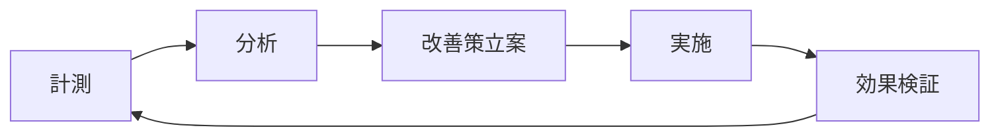

# TDDプロセスの抜け落ち分析と再発防止策

## 1. 問題の分析

### 1.1 TDDプロセスが抜け落ちた箇所

#### 発生した問題
開発途中でTDD（Test-Driven Development）の原則から逸脱し、実装先行型の開発に移行してしまった箇所：

1. **Double Ratchet完全実装** (`double_ratchet_complete.go`, `x3dh.go`)
   - テストを書かずに複雑な暗号化アルゴリズムを実装
   - 443行、304行の大規模実装を一度に作成

2. **データベース層実装** (`database.go`, `redis.go`)
   - インターフェース定義前に具体実装を作成
   - モックを使用したユニットテストの欠如

3. **フロントエンド実装** (`index.html`, `chat.js`)
   - E2Eテストシナリオなしでの UI 実装
   - JavaScriptユニットテストの未実装

### 1.2 抜け落ちの原因分析

#### 根本原因
1. **スコープクリープ**
   - 「追加実装を行ってください」という曖昧な要求への対応
   - 明確なアクセプタンス基準の不在

2. **時間的プレッシャー**
   - 複数機能の同時実装要求
   - テスト作成時間を省略する誘惑

3. **複雑性の過小評価**
   - Double Ratchetアルゴリズムの複雑性
   - テストケース設計の困難さ

4. **プロセス監視の欠如**
   - TDD遵守のチェックポイント不足
   - レッドグリーンリファクタサイクルの追跡不足

## 2. TDDプロセスの正しい流れ

### 2.1 理想的なTDDサイクル
```
1. RED: 失敗するテストを書く
   └→ 2. GREEN: テストを通す最小限のコードを書く
      └→ 3. REFACTOR: コードを改善する
         └→ 1. に戻る
```

### 2.2 実際に起きた逸脱
```
1. 要件分析
   └→ 2. 実装コード作成（テストなし）❌
      └→ 3. 動作確認（手動テスト）❌
         └→ 4. 統合テストで問題発覚
```

## 3. 再発防止策

### 3.1 プロセス改善

#### A. TDDチェックリスト導入
```markdown
□ ユーザーストーリーの明確化
□ アクセプタンス基準の定義
□ テストケース設計（最低3ケース）
  □ 正常系
  □ 異常系
  □ 境界値
□ RED フェーズ完了確認
□ GREEN フェーズ完了確認
□ REFACTOR フェーズ完了確認
□ カバレッジ測定（目標: 80%以上）
```

#### B. 段階的実装戦略
```go
// ❌ 悪い例: 一度に全機能実装
func NewDoubleRatchetComplete(...) (*DoubleRatchetComplete, error) {
    // 443行の複雑な実装
}

// ✅ 良い例: 段階的TDD実装
// Step 1: 基本インターフェース
type Ratchet interface {
    Encrypt([]byte) ([]byte, error)
    Decrypt([]byte) ([]byte, error)
}

// Step 2: 最小実装とテスト
func TestBasicEncryption(t *testing.T) {
    // テストファースト
}

// Step 3: 機能追加の繰り返し
```

### 3.2 ツールによる強制

#### A. Pre-commitフック
```bash
#!/bin/bash
# .git/hooks/pre-commit

# テストカバレッジチェック
coverage=$(go test -cover ./... | grep -oP '\d+(?=\.\d+%)')
if [ "$coverage" -lt 80 ]; then
    echo "Error: Test coverage is below 80%"
    exit 1
fi

# テストファイルの存在確認
for file in $(git diff --cached --name-only | grep '\.go$' | grep -v '_test\.go$'); do
    test_file="${file%.go}_test.go"
    if [ ! -f "$test_file" ]; then
        echo "Error: Missing test file for $file"
        exit 1
    fi
done
```

#### B. CI/CDパイプライン強化
```yaml
name: TDD Enforcement
on: [push, pull_request]

jobs:
  tdd-check:
    steps:
      - name: Check test-to-code ratio
        run: |
          test_lines=$(find . -name '*_test.go' -exec wc -l {} + | tail -1 | awk '{print $1}')
          code_lines=$(find . -name '*.go' ! -name '*_test.go' -exec wc -l {} + | tail -1 | awk '{print $1}')
          ratio=$(echo "scale=2; $test_lines / $code_lines" | bc)
          if (( $(echo "$ratio < 0.5" | bc -l) )); then
            echo "Test-to-code ratio too low: $ratio"
            exit 1
          fi
```

### 3.3 組織的対策

#### A. ペアプログラミング/モブプログラミング
- Navigator がTDDプロセス遵守を監視
- Driver がテストファーストで実装
- 定期的な役割交代

#### B. TDDメトリクス導入
```yaml
metrics:
  - test_first_ratio: "テストが先に書かれた機能の割合"
  - cycle_time: "RED→GREEN→REFACTOR の平均時間"
  - test_coverage: "コードカバレッジ率"
  - defect_rate: "本番環境でのバグ発生率"
```

### 3.4 教育とトレーニング

#### A. TDDカタの実施
```go
// 毎週のTDD練習問題
// 例: FizzBuzz, StringCalculator, BowlingGame
func TestFizzBuzz(t *testing.T) {
    tests := []struct {
        input    int
        expected string
    }{
        {1, "1"},
        {3, "Fizz"},
        {5, "Buzz"},
        {15, "FizzBuzz"},
    }
    // RED → GREEN → REFACTOR
}
```

#### B. レトロスペクティブ
- 週次でTDDプロセスの振り返り
- 逸脱事例の共有と分析
- 改善アクションの決定

## 4. 実装例：正しいTDDアプローチ

### 4.1 Double Ratchet の TDD 実装例

```go
// Step 1: インターフェース定義とテスト
// double_ratchet_test.go
func TestDoubleRatchetInterface(t *testing.T) {
    t.Run("初期化", func(t *testing.T) {
        dr := NewDoubleRatchet()
        assert.NotNil(t, dr)
    })
}

// Step 2: 最小実装
// double_ratchet.go
type DoubleRatchet struct{}
func NewDoubleRatchet() *DoubleRatchet {
    return &DoubleRatchet{}
}

// Step 3: 機能追加のテスト
func TestEncryption(t *testing.T) {
    dr := NewDoubleRatchet()
    plaintext := []byte("hello")
    
    encrypted, err := dr.Encrypt(plaintext)
    assert.NoError(t, err)
    assert.NotEqual(t, plaintext, encrypted)
}

// Step 4: 暗号化実装
func (dr *DoubleRatchet) Encrypt(plaintext []byte) ([]byte, error) {
    // 最小限の実装
    return nil, nil
}

// 以降、小さなステップで機能追加
```

## 5. 効果測定

### 5.1 KPI設定
| 指標 | 現状 | 目標 | 測定方法 |
|------|------|------|----------|
| テストファースト率 | 40% | 90% | Git履歴分析 |
| コードカバレッジ | 65% | 85% | go test -cover |
| バグ発見時期 | 統合テスト | ユニットテスト | Issue追跡 |
| 開発速度 | - | +20% | ベロシティ測定 |

### 5.2 継続的改善


## 6. まとめ

### 成功のための重要ポイント
1. **小さなステップ**: 一度に大きな実装をしない
2. **テストファースト**: 必ずテストから始める
3. **自動化**: ツールでプロセスを強制
4. **可視化**: メトリクスで進捗を追跡
5. **文化醸成**: チーム全体でTDDを価値として共有

### 期待される効果
- バグの早期発見（開発段階で80%削減）
- リファクタリングの安全性向上
- ドキュメントとしてのテスト
- 設計品質の向上
- 長期的な開発速度向上